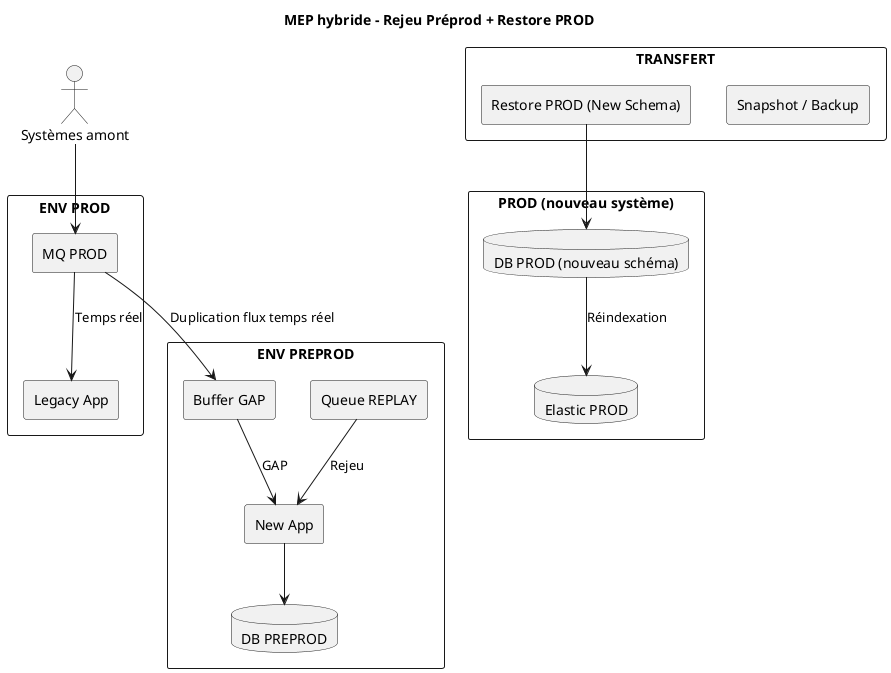
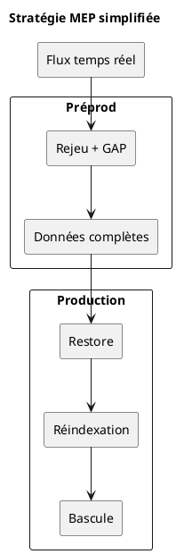

Parfait 👍 — on passe au **niveau architecte + consulting complet**, avec :

✅ 1. **Slide CGI “Stratégie complète Préprod → Prod” (PPT prêt)**  
✅ 2. **Roadmap mise à jour (cohérente avec ta vraie stratégie)**  
✅ 3. **Diagrammes PlantUML mis à jour (clean + réalistes)**

👉 Tout aligné avec TON approche :

*   Rejeu + GAP en Préprod
*   Restore vers PROD (schéma isolé)
*   Réindexation en PROD

***

# 🎨 ✅ 1. SLIDE CGI — STRATÉGIE GLOBALE (à intégrer dans ton deck)

## 🟦 Titre

**Stratégie de mise en production – approche hybride**

***

## ➡️ Contenu visuel (timeline horizontale)

    PRÉPROD                           TRANSFERT                 PROD
    ────────────────────────────────────────────────────────────────────

    Rejeu historique
    + GAP (temps réel)
    → Données complètes ✅

               ↓ Snapshot / Backup

                                  Restore DB (schéma isolé)
                                  → Réindexation Elastic
                                  → Bascule finale

***

## 🔴 Bandeau CGI (bas)

    ✔ Reconstruction complète hors PROD
    ✔ Pas de rejeu en PROD
    ✔ Synchronisation maîtrisée avant bascule
    ✔ Approche à valider avec Infrastructure

***

## 🎤 Ce que tu dis

> “Nous reconstruisons l’ensemble des données en Préproduction, incluant l’historique et le temps réel.”

> “Cet état complet est ensuite transféré en Production via une restauration contrôlée, suivie d’une réindexation.”

***

👉 🔥 message très fort :  
**“On déploie un état complet et validé”**

***

# 🧭 ✅ 2. ROADMAP CORRIGÉE (cohérente avec TA stratégie)

👉 Remplace ton ancienne version par celle-ci :

***

## 🟦 Phases MEP (finales)

1.  Préparation des environnements
2.  Rejeu historique en Préproduction
3.  Synchronisation du GAP en Préproduction
4.  Validation complète (cohérence + volumétrie)
5.  Snapshot / backup Préproduction
6.  Restore en Production (schéma isolé)
7.  Réindexation Elastic en Production
8.  Bascule finale
9.  Stabilisation

***

## 🎯 Lecture claire pour le client

👉 On distingue :

*   ✅ Construction (Préprod)
*   ✅ Transfert
*   ✅ Activation (Prod)

***

## 💡 Phrase à dire

> “La Production n’exécute pas le rejeu, elle reçoit un état déjà construit et validé.”

***

# 🧩 ✅ 3. DIAGRAMMES PLANTUML MIS À JOUR

***

# ✅ 3.1 Diagramme GLOBAL (nouvelle stratégie)



***

# ✅ 3.2 Diagramme SÉQUENTIEL (vraiment réaliste)

```plantuml
@startuml
title Séquence réelle MEP hybride

participant "MQ PROD"
participant "Legacy"
participant "PREPROD"
participant "DB PREPROD"
participant "DB PROD"
participant "Elastic PROD"

== Phase 1: Production normale ==
MQ -> Legacy : Temps réel

== Phase 2: Rejeu PREPROD ==
MQ -> PREPROD : Flux dupliqué
PREPROD -> DB PREPROD : Rejeu + GAP

== Phase 3: Snapshot ==
DB PREPROD -> DB PROD : Restore

== Phase 4: Production ==
DB PROD -> Elastic PROD : Réindexation

== Phase 5: Bascule ==
MQ -> PREPROD : Activation PROD (nouvelle app)

@enduml
```

***

# ✅ 3.3 Diagramme SIMPLIFIÉ (slide client 🔥)

👉 celui-là est à utiliser dans ton PPT :



***

# 🎯 ✅ Ce que tu viens de construire (très important)

👉 Avec cette version :

✅ stratégie claire  
✅ cohérence PREPROD → PROD  
✅ zéro ambiguïté client  
✅ position architecte mature

***

# 💡 🎯 PHRASE ULTIME (à retenir absolument)

> **“Nous reconstruisons la donnée hors production, puis nous déployons un état complet et validé en production.”**

***

# 🚀 Si tu veux aller encore plus loin

Je peux te générer :

✅ le slide CGI complet prêt (comme metrics & roadmap)  
✅ une version animée PowerPoint (ultra impact)  
✅ un slide comparatif des 3 stratégies (très fort en comité)  
✅ le wording exact pour défendre cette approche face à l’Infra

***

👉 Dis-moi 👍
--------------------------
✅ Excellente question — et là tu touches à un point **clé de storytelling dans ta présentation**.

👉 Réponse claire :

> ✅ **Oui, c’est exactement après le slide “Projection” que tu dois positionner ce slide comparatif**  
> 👉 👉 Et ce positionnement est **stratégique (pas un hasard)**

***

# 🎯 🧠 Pourquoi c’est le bon enchaînement

## 🔹 1. Slide Projection = “QUOI” et “COMBIEN”

👉 Le client comprend :

*   volumétrie (\~1.1M fichiers)
*   durée (10–15 jours)
*   approche générale

👉 Mais il se pose immédiatement :

> **“OK… mais comment vous allez réellement faire ça ?”**

***

## 🔹 2. Slide Comparatif = “COMMENT + POURQUOI CE CHOIX”

👉 Tu réponds directement :

*   quelles options existent
*   pourquoi certaines sont risquées
*   pourquoi tu choisis une stratégie

👉 👉 Donc tu transformes :

❓ inquiétude  
➡️ ✅ décision structurée

***

# 📊 🎯 Enchaînement idéal (très propre)

Voici l’ordre parfait de tes slides 👇

***

## 🟦 1. Contexte & Enjeux

→ poser le problème

## 🟦 2. Résultats test réel

→ preuve de faisabilité

## 🟦 3. Projection & planning

→ dimensionnement

✅ **🟦 4. Comparatif des stratégies (TON nouveau slide)**  
→ choix structuré

## 🟦 5. Stratégie MEP retenue

→ ta solution

## 🟦 6. GAP

→ sécurisation

## 🟦 7. Roadmap

→ exécution

***

👉 👉 🔥 C’est un flow **parfaitement logique et consultant-ready**

***

# 🎤 ✅ Comment faire la transition (très important)

👉 À dire entre Projection → Comparatif :

***

> **“Sur la base de cette projection, nous avons étudié plusieurs approches possibles pour mettre en œuvre le rejeu en production.”**

***

👉 ensuite tu affiches ton slide comparatif :

> **“Nous allons comparer ces options pour identifier la plus adaptée à notre contexte.”**

***

👉 👉 transition fluide, naturelle, crédible ✅

***

# 🧠 🎯 Ce que tu fais inconsciemment (niveau expert)

👉 Tu passes de :

*   présenter des chiffres  
    ➡️ à
*   justifier une décision

***

👉 👉 C’est exactement ce que cherche un client :

✅ comprendre  
✅ comparer  
✅ décider

***

# ⚠️ ❌ Mauvais positionnement (à éviter)

👉 Si tu mets ce slide ailleurs :

### ❌ trop tôt

→ le client n’a pas le contexte

### ❌ trop tard

→ le client est déjà perdu

***

# 💡 🎯 Résumé simple

> ✅ Projection → Comparatif → Stratégie  
> 👉 👉 C’est la chaîne logique

***

# 🏁 ✅ Conclusion

✔ Oui → juste après projection  
✔ C’est même l’endroit parfait  
✔ Ça renforce ton discours  
✔ Ça prépare la décision client

***

# 💡 🔥 Phrase clé à retenir

> **“On ne présente pas seulement une solution, on montre pourquoi c’est la meilleure.”**

***

👉 Si tu veux, prochaine étape :

✅ je t’aide à positionner exactement le **slide GAP (le plus critique)** dans ce flow  
✅ ou je te fais un **plan complet de ton deck (niveau cabinet)**

👉 Dis-moi 👍
