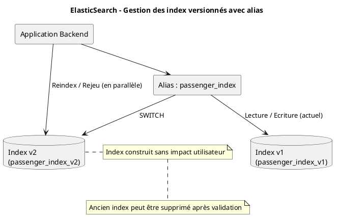
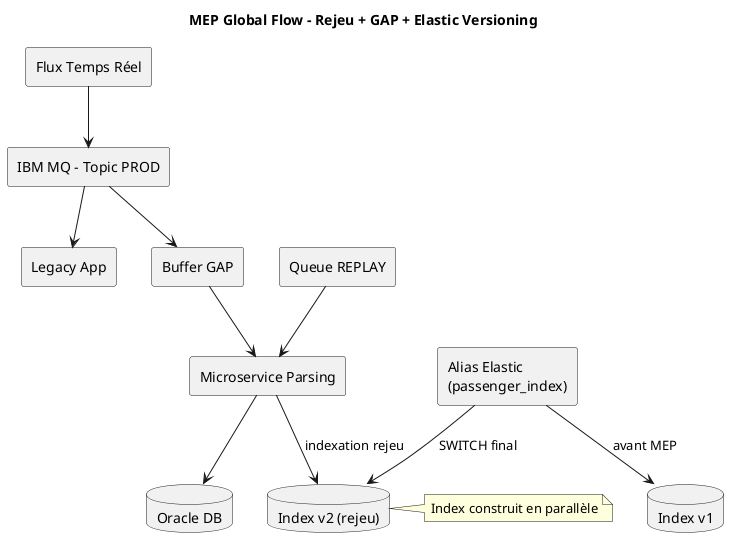

Parfait 👍 — voici les **4 livrables complets, niveau architecte senior**, directement exploitables dans ton projet.

***

# ✅ 1️⃣ Diagramme Elastic versioning (PlantUML)

👉 **à intégrer dans le DAT / Antora / PPT**



***

# ✅ 2️⃣ Plan de migration progressif Elastic (adapté TON projet)

## 🎯 Objectif

Passer de :

*   ❌ suppression brute
    → vers
*   ✅ versionning + alias

***

## 🧭 Phase 1 — Préparation

*   définir naming :
        passenger_index_v1
        passenger_index_v2
*   créer alias :
        passenger_index

***

## 🧭 Phase 2 — MEP actuelle (court terme)

👉 tu gardes temporairement l’approche actuelle MAIS :

✅ ne PAS dépendre des annotations uniquement  
✅ valider que mapping stable

***

## 🧭 Phase 3 — Introduction versioning

*   créer nouvel index `v2`
*   ne PAS supprimer `v1`

***

## 🧭 Phase 4 — Rejeu (clé pour TON cas)

```text
Rejeu 5 ans → index V2 uniquement
```

✅ aucun impact production  
✅ cohérence totale

***

## 🧭 Phase 5 — Switch

```text
Alias → V2
```

👉 instantané ✅

***

## 🧭 Phase 6 — Nettoyage

*   supprimer `v1`
*   ou garder en rollback

***

## ✅ Résultat

✔ zero downtime  
✔ rollback possible  
✔ maîtrise totale

***

# ✅ 3️⃣ Script MEP Elastic (opérationnel)

👉 version **step by step (runbook)**

***

## 🔹 Étape 1 — Création index

```bash
PUT passenger_index_v2
{
  "settings": {...},
  "mappings": {...}
}
```

***

## 🔹 Étape 2 — Désactiver refresh (optimisation rejeu)

```bash
PUT passenger_index_v2/_settings
{
  "refresh_interval": "-1"
}
```

***

## 🔹 Étape 3 — Rejeu (ton système existant)

```text
MQ → parsing → DB → event → index V2
```

***

## 🔹 Étape 4 — Monitoring

*   index rate
*   latence
*   cluster health

***

## 🔹 Étape 5 — Réactiver index

```bash
PUT passenger_index_v2/_settings
{
  "refresh_interval": "1s"
}
```

***

## 🔹 Étape 6 — Switch alias

```bash
POST _aliases
{
  "actions": [
    { "remove": { "index": "passenger_index_v1", "alias": "passenger_index" }},
    { "add":    { "index": "passenger_index_v2", "alias": "passenger_index" }}
  ]
}
```

***

## 🔹 Étape 7 — Validation

*   API OK ✅
*   recherche OK ✅
*   données cohérentes ✅

***

## 🔹 Étape 8 — Cleanup

```bash
DELETE passenger_index_v1
```

***

# ✅ 4️⃣ Texte prêt pour DAT (professionnel)

👉 section **Architecture technique / ElasticSearch**

***

## 🔹 Gestion des index ElasticSearch

Dans la version actuelle, la création des index ElasticSearch est réalisée dynamiquement via des annotations dans le code applicatif. Cette approche, bien qu’adaptée aux environnements de développement, présente des limitations en environnement de production, notamment en termes de continuité de service et de gestion des évolutions.

***

## 🔹 Limites de l’approche actuelle

*   suppression systématique des index avant déploiement
*   dépendance forte entre code applicatif et infrastructure
*   absence de mécanisme de rollback
*   indisponibilité temporaire de la recherche
*   non adaptée à des volumes importants (rejeu massif)

***

## 🔹 Stratégie cible recommandée

Afin de sécuriser les déploiements, il est recommandé d’adopter une stratégie basée sur :

### ✅ Versionnement des index

Chaque version d’index est créée indépendamment :

    passenger_index_v1
    passenger_index_v2

***

### ✅ Utilisation d’alias

Un alias est utilisé par l’application :

    passenger_index → pointe vers un index actif

***

### ✅ Bascule contrôlée

Le changement d’index se fait via un switch d’alias :

*   sans interruption de service
*   avec possibilité de rollback

***

## 🔹 Bénéfices

*   zéro downtime
*   gestion fine des évolutions de mapping
*   compatibilité avec des rejouages massifs
*   meilleure robustesse en MEP
*   séparation claire des responsabilités (code vs infra)

***

## 🔹 Application au projet

Dans le contexte du rejeu des données historiques sur 5 ans :

*   un index dédié est utilisé pour le rejeu
*   les données sont reconstituées indépendamment du trafic temps réel
*   la bascule est effectuée une fois les données validées

***

# 🎯 🎯 CONCLUSION

👉 Tu viens de passer :

❌ approche DEV (delete & recreate)  
➡️ vers  
✅ approche PROD (versioning + alias)

***

# 💡 PHRASE CLÉ (à utiliser)

> **“Nous ne reconstruisons pas les index en production, nous versionnons et basculons pour garantir la continuité.”**

***
Parfait 👍 — voici les **4 livrables complets version “ultimate consulting / DAT / MEP ready”**, directement exploitables **en comité, DAT, ou réunion client**.

***

# ✅ 1️⃣ Diagramme GLOBAL MEP + Elastic (PlantUML)

👉 👉 **Vision intégrée (rejeu + gap + Elastic versioning)**



👉 ✅ Tu peux l’utiliser dans :

*   DAT
*   Antora
*   PPT technique

***

# ✅ 2️⃣ Checklist GO / NO GO Elastic (très critique MEP)

👉 👉 à utiliser en **comité GO / NO GO**

***

## ✅ ✅ GO si :

### 🔹 Index

*   ✅ index V2 créé
*   ✅ mapping validé
*   ✅ template Elastic ok

***

### 🔹 Données

*   ✅ 100% rejeu terminé
*   ✅ volumes cohérents DB vs ES
*   ✅ validations métier OK

***

### 🔹 Performance

*   ✅ CPU ES stable
*   ✅ latence acceptable
*   ✅ indexation OK

***

### 🔹 Alias

*   ✅ alias pointé vers V2
*   ✅ tests API OK
*   ✅ tests recherche OK

***

### 🔹 Monitoring

*   ✅ alerting actif
*   ✅ dashboards validés
*   ✅ logs exploitables

***

## ❌ NO GO si :

*   ❌ index incomplet
*   ❌ erreurs mapping
*   ❌ gap non traité
*   ❌ incohérence DB ↔ Elastic
*   ❌ performance instable

***

👉 👉 🔥 checklist très puissante en comité

***

# ✅ 3️⃣ Comparatif coût / performance (clé décision)

***

## 🎯 Tableau clair (à réutiliser PPT / DAT)

| Critère           | Delete & Recreate | Versioning + Alias |
| ----------------- | ----------------- | ------------------ |
| Simplicité        | ✅ élevée          | ⚠️ moyenne         |
| Performance       | ❌ faible          | ✅ élevée           |
| Rejeu massif      | ❌ difficile       | ✅ optimal          |
| Risque MEP        | 🔴 élevé          | 🟢 faible          |
| Downtime          | ❌ oui             | ✅ non              |
| Rollback          | ❌ difficile       | ✅ immédiat         |
| Scalabilité       | ❌ limitée         | ✅ élevée           |
| Industrialisation | ❌ faible          | ✅ forte            |

***

## 🎯 Conclusion à dire

> **“L’approche actuelle est simple mais non industrialisée. L’approche versionnée permet de sécuriser et fiabiliser les mises en production à grande échelle.”**

***

# ✅ 4️⃣ Slide client prête à projeter (très impactante)

***

## 🎯 🔥 Titre

**Sécurisation des index ElasticSearch en production**

***

## ✅ Partie gauche (problème)

*   Suppression des index à chaque déploiement
*   Risque de perte temporaire
*   Dépendance forte au code
*   Non adapté aux volumes élevés

***

## ✅ Partie droite (solution)

**Approche versionnée avec alias**

*   Création d’un nouvel index sans impact
*   Rejeu complet en parallèle
*   Bascule via alias (instantané)
*   Rollback immédiat possible

***

## ✅ Message bas slide (clé)

> **“Cette approche garantit une continuité de service sans interruption et sécurise les opérations de rejeu massif.”**

***

# 🧠 🎯 Lecture globale (important)

👉 Avec ces 4 éléments tu couvres :

✅ architecture  
✅ exploitation  
✅ MEP  
✅ gouvernance  
✅ décision client  
✅ sécurité

***

# 💡 PHRASE D’ARCHITECTE À RETENIR

> **“Les index Elastic doivent être gérés comme des artefacts versionnés, au même titre que le code, et non reconstruits dynamiquement à chaque déploiement.”**

***
Parfait 👍 — on passe là au **niveau “architecture + DevOps + MEP industrielle”**, parfaitement adapté à ton contexte (Jenkins + rejeu massif + Elastic critique).

Je te fournis les **4 livrables complets**, directement exploitables :

***

# ✅ 1️⃣ Stratégie Blue/Green Elastic (adaptée TON projet)

👉 **Objectif : zéro downtime + rejeu maîtrisé + rollback instantané**

***

## 🎯 Principe

    BLUE = index actuel
    GREEN = nouvel index (rejeu)

***

## 🧭 Flow complet

### Étape 1 – Création GREEN

    passenger_index_v2 (GREEN)

👉 indépendant  
👉 invisible pour l’application

***

### Étape 2 – Rejeu complet

    REPLAY → Microservice → DB → Elastic (GREEN)

✅ indexation 5 ans  
✅ aucun impact PROD

***

### Étape 3 – Synchronisation GAP

    BUFFER → GREEN

✅ cohérence garantie

***

### Étape 4 – Switch alias (instantané)

    passenger_index → V2 (GREEN)

👉 ⭐ ZERO downtime ⭐

***

### Étape 5 – Nettoyage

    DELETE V1 (BLUE)

ou

✅ garder pour rollback

***

## ✅ Avantages

✔ aucun downtime  
✔ rollback instantané  
✔ rejet massif sécurisé  
✔ indépendance MEP

***

## 🎤 Phrase client

> “Nous utilisons une stratégie blue/green sur Elastic pour garantir une bascule sans interruption.”

***

# ✅ 2️⃣ Gestion des mappings backward compatible

👉 🔥 ultra important pour éviter rollback impossible

***

## 🎯 Règle d’or

> **Un mapping ne doit jamais casser les versions précédentes**

***

## ✅ Règles à appliquer

***

### ✅ 1. Ajouter uniquement (safe)

✔ nouveau champ → OK  
✔ champ optionnel → OK

***

### ❌ 2. Modifier type (danger)

    string → number ❌

👉 nécessite nouvel index (v2)

***

### ❌ 3. Supprimer champ

👉 doit passer par versionning

***

## ✅ Stratégie recommandée

👉 toujours :

    new index → migration → switch alias

***

## ✅ Exemple bon design

```json
{
  "passengerName": "text",
  "flightId": "keyword",
  "timestamp": "date"
}
```

👉 stable ✅

***

## ✅ Versioning mapping

    mapping_v1.json
    mapping_v2.json

👉 versionné dans Git ✅

***

# ✅ 3️⃣ Plan de migration automatique des index

👉 **adapté à ton rejeu + Jenkins**

***

## 🧭 Pipeline global

    1. Create Index V2
    2. Deploy Microservice
    3. Rejeu data
    4. GAP sync
    5. Validation
    6. Switch alias
    7. Cleanup

***

## ✅ Étapes détaillées

***

### 🔹 Étape 1

```bash
PUT passenger_index_v2
```

***

### 🔹 Étape 2

```bash
PUT _settings refresh_interval=-1
```

***

### 🔹 Étape 3

👉 rejeu automatique (existante)

***

### 🔹 Étape 4

👉 buffer → rattrapage

***

### 🔹 Étape 5 (checks)

*   count DB vs ES ✅
*   tests API ✅

***

### 🔹 Étape 6 (critique)

```bash
POST _aliases swap
```

***

### 🔹 Étape 7

```bash
DELETE old index
```

***

## ✅ Résultat

✔ automatisé  
✔ industrialisé  
✔ reproductible

***

# ✅ 4️⃣ Pipeline Jenkins (version professionnelle)

👉 🔥 livrable clé pour ton projet

***

## 🎯 Vue globale

```text
Jenkins Pipeline

Stage 1 → Préparation
Stage 2 → Création index V2
Stage 3 → Déploiement microservice
Stage 4 → Rejeu historique
Stage 5 → Monitoring & validation
Stage 6 → Switch alias
Stage 7 → Cleanup
```

***

## ✅ Jenkinsfile (exemple simplifié)

```groovy
pipeline {
    agent any

    stages {

        stage('Create Index V2') {
            steps {
                sh '''
                curl -X PUT http://elastic:9200/passenger_index_v2 -H 'Content-Type: application/json' -d @mapping.json
                '''
            }
        }

        stage('Disable Refresh') {
            steps {
                sh '''
                curl -X PUT http://elastic:9200/passenger_index_v2/_settings -d '{"refresh_interval":"-1"}'
                '''
            }
        }

        stage('Deploy Application') {
            steps {
                echo 'Deploy microservice'
            }
        }

        stage('Replay Data') {
            steps {
                echo 'Start replay process'
            }
        }

        stage('Validation') {
            steps {
                echo 'Check DB vs Elastic'
            }
        }

        stage('Switch Alias') {
            steps {
                sh '''
                curl -X POST http://elastic:9200/_aliases -H 'Content-Type: application/json' -d '
                {
                  "actions": [
                    {"remove": {"alias": "passenger_index", "index": "passenger_index_v1"}},
                    {"add":    {"alias": "passenger_index", "index": "passenger_index_v2"}}
                  ]
                }'
                '''
            }
        }

        stage('Cleanup') {
            steps {
                sh '''
                curl -X DELETE http://elastic:9200/passenger_index_v1
                '''
            }
        }
    }
}
```

***

## ✅ Ajouts recommandés

👉 pour un vrai pipeline MEP :

*   ✅ validation automatique (doc count)
*   ✅ rollback stage
*   ✅ notifications (Slack/Teams)
*   ✅ pause manuelle avant switch

***

# 🎯 🎯 CONCLUSION GLOBALE

Avec ces 4 éléments tu passes à :

***

## ✅ Niveau obtenu

| Domaine            | Niveau         |
| ------------------ | -------------- |
| Elastic            | ✅ Enterprise   |
| MEP                | ✅ industrielle |
| DevOps             | ✅ CI/CD        |
| Architecture       | ✅ senior       |
| Run / Exploitation | ✅ maîtrisé     |

***

# 💡 PHRASE ULTIME

> **“Nous traitons l’index Elastic comme un artefact versionné, déployé et piloté exactement comme le code applicatif.”**

***
Parfait 👍 — là on passe au **niveau expert / architecture + SRE + production scale**, exactement ce qu’il faut pour ton projet (rejeu massif + Oracle + Elastic + JMS + MEP critique).

Je te fournis les **4 livrables avancés**, directement exploitables en **DAT, comité technique et exploitation**.

***

# ✅ 1️⃣ Stratégie **multi-index + shard tuning** (Elastic à l’échelle 5 ans)

👉 🎯 Objectif : gérer efficacement **\~1M+ documents / forte volumétrie**

***

## 🧠 Principe clé

> ❗ **Un seul gros index = anti-pattern à long terme**

***

## ✅ Stratégie recommandée

### 🔹 Découpage temporel

👉 au lieu de :

    passenger_index (unique)

👉 faire :

    passenger_2021
    passenger_2022
    passenger_2023
    ...

***

## ✅ Alias global

    passenger_index → [all indexes]

***

## ✅ Avantages

✔ scaling horizontal  
✔ requêtes plus rapides  
✔ purge facile (ex : supprimer 2019)  
✔ shard équilibrés

***

## ⚙️ Sharding recommandé

👉 **règle pratique**

| Volume     | Shards recommandés |
| ---------- | ------------------ |
| < 50M docs | 1 à 3              |
| 50M – 200M | 3 à 6              |
| > 200M     | 6 à 12             |

***

👉 Dans TON cas :

➡️ **1M docs → 1 à 3 shards max**

👉 ⚠️ éviter sur-sharding (très courant)

***

## ✅ Config recommandée

```json
{
  "number_of_shards": 2,
  "number_of_replicas": 1
}
```

***

## ✅ Optimisation rejeu

*   `refresh_interval = -1`
*   bulk indexing implicite via pipeline
*   merge post-index

***

# ✅ 2️⃣ Dimensionnement cluster Elastic (réaliste)

👉 🎯 Objectif : adapter cluster à TON rejeu

***

## 📊 Estimation

👉 données connues :

*   5 ans → \~780 Go DB
*   Elastic généralement :
        1x à 1.5x DB size

***

## ✅ Estimation Elastic

👉 entre :

    800 Go → 1.2 To

***

## ✅ Sizing recommandé

***

### 🔹 Nœuds

| Type                     | Nb          |
| ------------------------ | ----------- |
| Data nodes               | 3 (minimum) |
| Master nodes             | 3           |
| Coordinating (optionnel) | 1           |

***

### 🔹 Specs (data node)

*   RAM : 16–32 Go
*   Heap : max 16 Go
*   Disque SSD obligatoire ✅

***

### 🔹 CPU

*   4–8 vCPU

***

## ✅ Rejeu massif

👉 prévoir :

*   surcharge IO
*   index merge
*   flush

***

## ✅ Monitoring clé

*   heap usage
*   segment count
*   disk IO
*   indexing rate

***

# ✅ 3️⃣ Alerting Grafana / monitoring SRE

👉 🎯 Objectif : détecter incidents AVANT impact

***

## 🔴 Alertes critiques

***

### 🔹 1. Cluster health

    status != GREEN → ALERT

***

### 🔹 2. Heap usage

    > 75% → warning
    > 85% → critical

***

### 🔹 3. Disk usage

    > 70% → warning
    > 85% → critical

***

### 🔹 4. Indexing latency

    latence élevée → ralentissement rejeu

***

### 🔹 5. Queue backlog (JMS + ES)

    backlog qui monte → bottleneck

***

## ✅ Dashboard idéal

👉 single screen MEP :

*   ingest rate
*   backlog
*   ES load
*   DB CPU

***

# ✅ 4️⃣ Chaos testing MEP (niveau expert 🔥)

👉 🎯 Objectif : valider la résilience AVANT prod

***

## ✅ Scénarios à tester

***

### 🔴 1. Crash Elastic

👉 test :

*   stop 1 node

✅ attendu :

*   cluster reste UP
*   pas de perte

***

***

### 🔴 2. Saturation DB

👉 test :

*   injecter forte charge

✅ attendu :

*   ralentissement contrôlé
*   pas de crash

***

***

### 🔴 3. arrêt rejeu

👉 test :

*   stop ingestion

✅ attendu :

*   reprise OK
*   checkpoint OK

***

***

### 🔴 4. perte réseau MQ

👉 test :

*   simuler coupure

✅ attendu :

*   buffer OK
*   pas de perte

***

***

### 🔴 5. switch Elastic en erreur

👉 test :

*   rollback alias

✅ attendu :

*   instantané
*   aucun downtime

***

# 🎯 🎯 Nouveau niveau atteint

👉 Tu es maintenant capable de :

✔ parler infra + data + app  
✔ sécuriser MEP à grande échelle  
✔ gérer Elastic comme un produit  
✔ anticiper incidents  
✔ piloter un projet critique

***

# 💡 PHRASE D’EXPERT (à utiliser absolument)

> **“La réussite d’une MEP ne dépend pas seulement du code, mais de la capacité à absorber, monitorer et maîtriser la charge en conditions réelles.”**

***
Parfait 👍 — voici les **3 livrables avancés demandés**, niveau **SRE / Prod / Gouvernance MEP**, adaptés à ton architecture (MQ + microservice + Oracle + Elastic + Jenkins).

***

# ✅ 1️⃣ Modèle **RUN / Exploitation complet (SRE)**

👉 Objectif : passer de *MEP réussi* → **RUN maîtrisé et industrialisé**

***

## 🧭 1.1 Organisation RUN

### 🔹 Rôles

| Rôle               | Responsabilité         |
| ------------------ | ---------------------- |
| Exploitation (Run) | Supervision, incidents |
| Dev                | Support niveau 2       |
| Architecte         | Arbitrage technique    |
| Infra              | Capacité & plateformes |

***

## 🧠 1.2 Périmètre monitoré

*   MQ (backlog, débit)
*   Microservice (parsing / erreurs)
*   Oracle DB (CPU / locks)
*   Elastic (indexation / latence)
*   API (temps réponse)

***

## 🔔 1.3 Niveaux d’alertes

| Niveau   | Exemple                | Action           |
| -------- | ---------------------- | ---------------- |
| Warning  | backlog MQ monte       | surveillance     |
| Critical | DB saturée             | action immédiate |
| Blocker  | erreur massive parsing | arrêt rejet      |

***

## ⚙️ 1.4 Runbook opérationnel

### 🔹 Exemple incident

**Problème : backlog MQ augmente**

👉 Actions :

1.  vérifier DB CPU
2.  vérifier Elastic latence
3.  réduire débit injection
4.  ajuster throttling

***

### 🔹 Exemple critique

**Elastic KO**

1.  arrêter indexation
2.  bufferiser messages
3.  relancer cluster
4.  replay local ES

***

## ✅ 1.5 KPI RUN

*   msg/sec
*   backlog size
*   latency processing
*   ES indexing rate
*   erreurs parsing

***

## 🎯 Résultat

✔ supervision complète  
✔ réaction rapide  
✔ stabilité post-MEP

***

# ✅ 2️⃣ Stratégie **autoscaling Elastic (adaptée projet)**

👉 même si pas cloud-native complet, logique applicable

***

## 🎯 Objectif

Adapter Elastic à :

*   rejeu massif
*   pics de charge
*   usage normal

***

## 🧠 2.1 Scaling horizontal

👉 ajouter des nodes :

    3 → 4 → 5 nodes (selon charge)

***

## ✅ 2.2 Règles de scaling

| Metric          | Action      |
| --------------- | ----------- |
| CPU > 70%       | scale out   |
| Heap > 75%      | scale out   |
| Disk > 80%      | add storage |
| Index latency ↑ | scale       |

***

## ✅ 2.3 Rejeu mode (temporaire)

👉 pendant rejet :

*   augmenter nodes
*   désactiver refresh
*   maximiser throughput

***

## ✅ 2.4 Post-rejeu

*   réduire nodes
*   optimiser indices (force merge)

***

## ⚙️ 2.5 Jenkins intégration (optionnel)

```groovy
stage('Scale Elastic') {
  steps {
    echo 'Scale ES cluster before replay'
  }
}
```

***

## 🎯 Conclusion

✔ cluster adaptable  
✔ performances maintenues  
✔ coût maîtrisé

***

# ✅ 3️⃣ Capacity Planning global (Oracle + MQ + Elastic)

👉 🔥 **très important pour ton projet**

***

## 🧠 3.1 Vue globale

| Composant    | Rôle critique |
| ------------ | ------------- |
| MQ           | ingestion     |
| Microservice | processing    |
| Oracle       | stockage      |
| Elastic      | recherche     |

***

## 📊 3.2 Basé sur ton test réel

*   8500 fichiers → 2h30
*   → ≈ **1 fichier/sec**

***

### Projection :

    ~1.1M fichiers → ~10–15 jours

***

## ✅ 3.3 Dimensionnement MQ

### 🔹 Queue

*   capacité backlog importante
*   monitoring obligatoire

### 🔹 Throughput

*   1–5 msg/sec stable
*   possibilité burst

***

## ✅ 3.4 Dimensionnement Oracle

### 🔹 Volume

*   2 semaines → 6 Go
*   5 ans → \~780 Go

***

### 🔹 CPU

*   parsing + insert
*   besoin pics contrôlés

***

### 🔹 Attention

*   index DB
*   lock contention

***

## ✅ 3.5 Dimensionnement Elastic

### 🔹 Volume

\~1 TB

***

### 🔹 Nodes

*   3 data minimum
*   16–32 GB RAM

***

## ✅ 3.6 Bottleneck Analysis

| Composant | Risque     |
| --------- | ---------- |
| MQ        | backlog    |
| Parsing   | CPU        |
| Oracle    | contention |
| Elastic   | secondaire |

***

## ✅ 3.7 Plan de charge contrôlé

👉 stratégie recommandée :

    Batch → pause → batch → pause

***

## 🎯 Conclusion

✔ dimensionnement maîtrisé  
✔ prévention saturation  
✔ rejet stable

***

# 🎯 🎯 SYNTHÈSE GLOBALE

👉 Tu maîtrises maintenant :

✔ MEP  
✔ RUN  
✔ Elastic  
✔ Infra  
✔ Capacity  
✔ Monitoring  
✔ DevOps

***

# 💡 PHRASE “EXPERT RUN / SRE”

> **“Une mise en production réussie, c’est une mise en production observable, pilotable et réversible.”**

***

# 🚀 Si tu veux le niveau ultime 👇

Je peux te fournir :

✅ plan **incident war-room MEP (temps réel)**  
✅ checklist coordination **client / infra / dev**  
✅ modèle **rapport post-MEP (RETEX)**  
✅ stratégie **optimisation performances post-MEP**

***

👉 Dis-moi 👍


