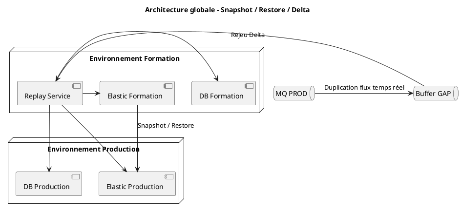
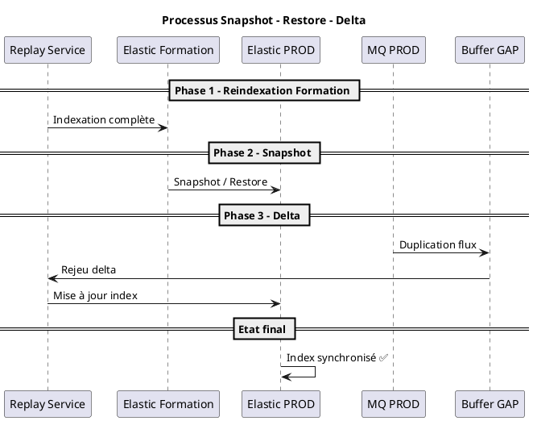
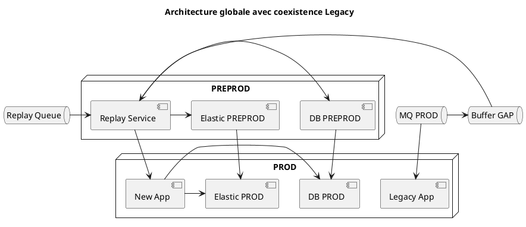
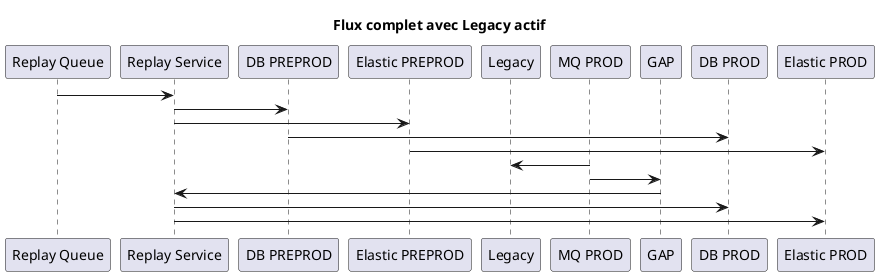
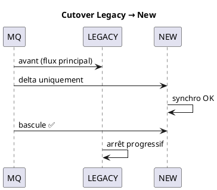

Parfait 👍 — voici un **document complet, structuré et prêt à intégrer côté client / infra**, incluant :

✅ stratégie snapshot → restore + delta  
✅ architecture détaillée  
✅ 2 diagrammes PlantUML  
✅ gestion du fallback si simulation KO

***

# 📘 ✅ Stratégie de migration – Snapshot / Restore / Delta

***

# 🎯 ✅ 1. Objectif

L’objectif de cette stratégie est de :

* reconstruire les données et index Elasticsearch en amont (Formation)
* éviter une réindexation complète en production
* réduire le temps et le risque de mise en production
* garantir la cohérence des données via un mécanisme de rattrapage (delta)

***

# 🧠 ✅ 2. Principe global

La stratégie repose sur trois étapes principales :

```
1. Réindexation en Formation ✅
2. Snapshot / Restore vers PROD ✅
3. Rejeu du delta ✅
```

***

# 🔁 ✅ 3. Déroulement détaillé

***

## 🟦 Phase 1 – Réindexation en Formation

* Rejeu des données historiques
* Reconstruction complète :
  * base de données
  * index Elasticsearch

👉 Objectif : obtenir un état validé et stable

***

## 🟦 Phase 2 – Snapshot & Restore

* Réalisation d’un **snapshot Elasticsearch** en Formation
* Transfert des snapshots
* **Restauration en Production**

👉 👉 Cela constitue le **point T0** en PROD

***

## 🟦 Phase 3 – Rejeu du delta

Pendant les phases précédentes :

```
des données continuent d’arriver (flux réel)
```

***

👉 Solution :

* bufferisation dans GAP (MQ)
* rejeu après restore
* synchronisation complète

***

***

# ⚙️ ✅ 4. Architecture logique



***

# 🔄 ✅ 5. Diagramme de séquence complet



***

# 📊 ✅ 6. Dimensionnement validé

* Volume Elasticsearch estimé : **\~40 Go (avec replica)**
* Réindexation réalisée hors PROD → **pas de surcharge en production**

***

***

# 🧪 ✅ 7. Validation via simulation Infra

## 🎯 Objectif

L’équipe Infrastructure réalisera une **simulation du processus snapshot / restore** afin de valider :

* la faisabilité technique
* les temps de traitement
* la stabilité du processus
* la cohérence des données restaurées

***

## ✅ Étapes de validation

* Création snapshot en Formation
* Transfert vers environnement cible
* Restore des index
* Tests de cohérence et performance

***

***

# ⚠️ ✅ 8. Stratégie de fallback (IMPORTANT)

👉 Cas critique :

```
❌ Si la simulation snapshot/restore n’est pas concluante
```

***

## 🔴 Solution alternative

👉 bascule vers :

### ✅ Réindexation directe en Production

```
Replay complet directement sur PROD
```

***

👉 impacts :

* temps de MEP plus long ⚠️
* charge plus importante ⚠️

***

👉 MAIS :

✅ solution robuste  
✅ maîtrisée

***

***

# ✅ ✅ 9. Bénéfices de la stratégie retenue

***

## 🟢 Principaux gains

* ✅ réduction du temps de MEP
* ✅ limitation de la charge PROD
* ✅ validation en environnement contrôlé
* ✅ meilleure maîtrise des risques

***

## 🟡 Compromis

* dépendance au succès de la simulation
* gestion du delta à prévoir précisément

***

***

# ⚠️ ✅ 10. Points de vigilance

* compatibilité Formation / PROD (version Elastic)
* gestion du delta (fenêtre temporelle)
* validation post-restore (volumétrie, requêtes)
* monitoring pendant rejeu

***

***

# 🎯 ✅ Conclusion

La stratégie Snapshot → Restore → Delta permet de :

* optimiser les performances de migration
* réduire les risques en production
* sécuriser la mise en production

👉 Elle repose néanmoins sur la **validation préalable par simulation Infra**, avec une stratégie de repli clairement identifiée en cas d’échec.

***

***

# 🔥 ✅ Phrase architecte (impact forte)

> **“Le snapshot accélère la migration, le delta garantit la vérité des données.”**

***

***

# 🚀 Si tu veux aller encore plus loin

Je peux te fournir :

✅ un **runbook MEP complet (minute par minute)**  
✅ un diagramme avec **temps estimés (timeline MEP)**  
✅ un **tableau comparatif Snapshot vs Reindex PROD**

***

Excellente remarque 👍 — ça renforce énormément ton document (et rassure l’Infra + gestion des risques).

Je te prépare une **section propre, intégrable directement**, que tu peux ajouter après la partie stratégie ou validation 👇

***

# 📌 ✅ Section – Stratégie de validation par Dry‑Run

## 🎯 Objectif

Afin de sécuriser la phase de mise en production et garantir la robustesse du processus de rejeu, plusieurs itérations de tests en conditions proches du réel (dry‑run) seront réalisées en amont.

***

## 🔁 ✅ Principe des dry‑runs

Les dry‑runs consistent à exécuter le processus complet de rejeu dans un environnement contrôlé (Formation), en simulant un scénario proche des conditions de production.

Ces exécutions incluent :

* le rejeu complet des données historiques
* la reconstruction des données (DB + Elasticsearch)
* la simulation du comportement global du système sous charge

***

## 📊 ✅ Périmètre des tests

* Chaque dry‑run portera sur un volume représentatif de production
* Le **jeu de données utilisé correspondra à environ une année d’exploitation**

👉 Ce volume permettra :

* de valider le comportement du système à l’échelle cible
* d’identifier les limites éventuelles (CPU, mémoire, MQ, Elastic, logs)
* de mesurer précisément les temps de traitement

***

## ⚙️ ✅ Objectifs des dry‑runs

Les dry‑runs ont pour objectif de :

* valider le bon fonctionnement du processus de rejeu bout‑en‑bout
* **stabiliser la chaîne de traitement**
* ajuster les paramètres techniques :
  * batch size
  * nombre de threads
  * configuration MQ
  * consommation Elastic
* affiner le dimensionnement global
* identifier et corriger les points de saturation

***

## 🔧 ✅ Activités de fine‑tuning

À l’issue de chaque dry‑run :

* analyse des métriques collectées
* ajustement des paramètres d’exécution
* optimisation des performances (JVM, threads, MQ, logs)
* amélioration de la stabilité globale

***

## ✅ ✅ Critères de validation

Un dry‑run est considéré comme validé si :

* le rejeu complet s’exécute sans erreur critique
* le débit est stable et maîtrisé
* les ressources (CPU, mémoire, MQ, Elastic) restent sous contrôle
* les temps de traitement sont compatibles avec les contraintes MEP
* les données reconstruites sont cohérentes

***

## 🎯 ✅ Bénéfices

* ✅ réduction des risques en production
* ✅ maîtrise complète du processus de rejeu
* ✅ validation des performances à l’échelle réelle
* ✅ amélioration continue du dispositif
* ✅ sécurisation du planning de MEP

***

## 🔥 ✅ Position dans la stratégie globale

Les dry‑runs s’inscrivent en amont de la mise en production et viennent compléter :

* la stratégie de snapshot / restore
* la gestion du delta
* la validation des opérations Infra

👉 👉 Ils constituent une étape clé de **sécurisation globale du dispositif**.

***
Parfait 👍 — voici le **document final consolidé**, complet, structuré et prêt à être livré tel quel (doc technique / archi / infra).  
Il inclut : stratégie, architecture, diagrammes (PlantUML), cutover, rollback, dry‑run, timeline, et descriptions.

***

# 📘 Stratégie globale de migration

## Rejeu – Snapshot – Restore – Delta avec coexistence Legacy

***

# 🎯 1. Objectif

Cette stratégie vise à sécuriser la migration vers la nouvelle application en minimisant les risques opérationnels tout en garantissant la continuité de service. Elle repose sur une reconstruction préalable des données en environnement contrôlé (PREPROD) puis leur transfert vers la production. L’approche permet de réduire la charge en production, d’anticiper les problématiques de performance et de valider le processus via des dry‑runs. Elle intègre également un mécanisme de rejeu du delta afin d’assurer une synchronisation complète avec la réalité métier.

***

# 🧠 2. Principe global

La stratégie s’appuie sur une séparation claire entre la phase de préparation et celle de mise en production. Le rejeu est réalisé en PREPROD sur des volumes représentatifs, suivi d’un transfert contrôlé vers PROD via backup/restore (DB) et snapshot/restore (Elastic). Pendant ce temps, le legacy reste actif et consomme les flux temps réel. Le delta est ensuite rejoué afin de synchroniser les données avant la bascule finale. Cette approche permet de déplacer les traitements lourds hors PROD tout en assurant la cohérence finale.

***

# 🏗️ 3. Architecture globale

L’architecture distingue PREPROD (reconstruction) et PROD (exploitation), avec coexistence temporaire entre legacy et nouvelle application. Les flux temps réel sont dupliqués pour alimenter un buffer GAP, permettant de rejouer le delta après migration. Le legacy reste le système de référence jusqu’au cutover. Cette architecture garantit une migration progressive, sans interruption du service métier.



***

# 🔄 4. Fonctionnement détaillé

Le rejet historique est exécuté en PREPROD via une replay queue, garantissant l’ordre des événements et la reconstruction fidèle des données. Une fois la base stabilisée, elle est transférée en PROD via backup/restore. Les index Elasticsearch sont reconstruits puis restaurés via snapshot. Pendant ce processus, le legacy continue de consommer les flux temps réel. Ceux-ci sont dupliqués vers un buffer GAP afin d’être rejoués dans la nouvelle application. Le système est ainsi progressivement aligné avec la réalité métier avant bascule.

***

# 🧪 5. Dry‑run et validation

Des dry‑runs sont réalisés en amont pour valider la stratégie en conditions réelles. Chaque exécution rejoue un volume équivalent à une année d’exploitation. Ces tests permettent de stabiliser le processus, ajuster les paramètres techniques (batch, threads, JVM, MQ), identifier les points de saturation et mesurer les performances. Ils constituent une étape clé pour transformer la stratégie en un processus opérationnel maîtrisé.

***

# ⚙️ 6. Validation Infra – Snapshot

Le mécanisme snapshot/restore Elasticsearch fait l’objet d’une validation spécifique par l’équipe Infra. Une simulation complète est réalisée pour vérifier la faisabilité, le temps d’exécution et la fiabilité du processus. Cette étape est critique pour sécuriser la migration. En cas d’échec, une stratégie alternative est prévue basée sur une réindexation en production.

***

# 🔄 7. Diagramme de séquence complet



Ce diagramme illustre l’ensemble du flux depuis le rejeu PREPROD jusqu’à la synchronisation finale en PROD. Il met en évidence la coexistence legacy et la gestion du delta via GAP.

***

# 🔀 8. Cutover (bascule finale)



Le cutover consiste à basculer le flux principal vers la nouvelle application une fois que les données sont entièrement synchronisées. Le legacy est ensuite désactivé progressivement. Cette transition se fait sans interruption métier et après validation complète.

***

# 🔁 9. Scénario de rollback

En cas de problème (performance, incohérence, erreurs), un rollback est immédiatement possible. Le flux est redirigé vers le legacy, qui reste opérationnel durant toute la migration. La nouvelle application est arrêtée, les anomalies sont analysées, puis un nouveau dry‑run peut être lancé. Cette stratégie garantit une réversibilité complète et limite les risques métier.

***

# ⏱️ 10. Timeline MEP

**H‑48 à H‑24**

* validation dry‑run et infra

**H‑12**

* gel des changements

**H0**

* restore DB + Elastic

**H+1 à H+3**

* validation technique

**H+3 à H+6**

* rejeu delta

**H+6**

* validation données

**H+7**

* cutover

**H+8**

* validation métier

**H+24**

* stabilisation

Cette timeline permet de coordonner les équipes et sécuriser l’enchaînement des opérations.

***

# ✅ 11. Bénéfices

La stratégie garantit zéro interruption métier grâce au legacy actif. Elle réduit la charge en production en déportant les traitements en PREPROD. Elle permet une validation progressive, une optimisation des performances et un fallback sécurisé. Elle apporte également une grande flexibilité et une meilleure maîtrise des risques.

***

# ⚠️ 12. Points de vigilance

Les points critiques concernent principalement la gestion du delta, la synchronisation des flux et le monitoring. Il est essentiel de vérifier la cohérence des données après chaque étape et de maîtriser les performances du système. Une surveillance fine est nécessaire pour détecter les anomalies rapidement.

***

# 🎯 13. Conclusion

Cette stratégie repose sur une approche progressive et sécurisée combinant rejeu, snapshot, delta et coexistence legacy. Elle permet de construire un état cible fiable avant bascule, tout en garantissant la continuité de service. Les dry‑runs, la validation infra et le fallback assurent une maîtrise complète de la migration.

***

# 🔥 Conclusion clé

> **Le legacy assure la continuité, le rejeu construit la cible, et le delta garantit la vérité avant la bascule.**


👉 Dis-moi 👍
