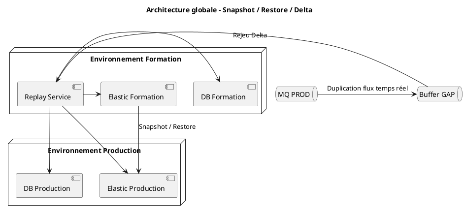
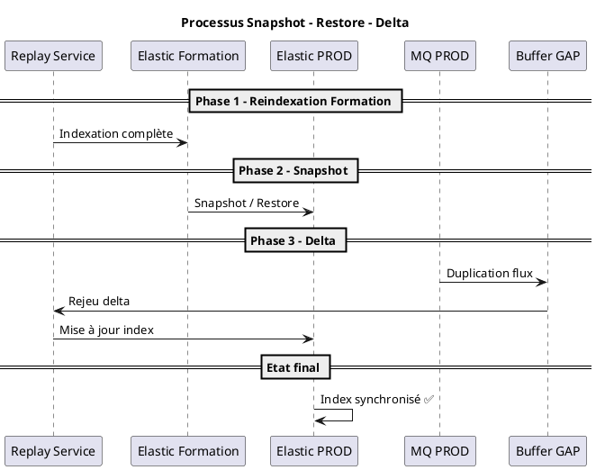

Parfait 👍 — voici un **document complet, structuré et prêt à intégrer côté client / infra**, incluant :

✅ stratégie snapshot → restore + delta  
✅ architecture détaillée  
✅ 2 diagrammes PlantUML  
✅ gestion du fallback si simulation KO

***

# 📘 ✅ Stratégie de migration – Snapshot / Restore / Delta

***

# 🎯 ✅ 1. Objectif

L’objectif de cette stratégie est de :

* reconstruire les données et index Elasticsearch en amont (Formation)
* éviter une réindexation complète en production
* réduire le temps et le risque de mise en production
* garantir la cohérence des données via un mécanisme de rattrapage (delta)

***

# 🧠 ✅ 2. Principe global

La stratégie repose sur trois étapes principales :

```
1. Réindexation en Formation ✅
2. Snapshot / Restore vers PROD ✅
3. Rejeu du delta ✅
```

***

# 🔁 ✅ 3. Déroulement détaillé

***

## 🟦 Phase 1 – Réindexation en Formation

* Rejeu des données historiques
* Reconstruction complète :
  * base de données
  * index Elasticsearch

👉 Objectif : obtenir un état validé et stable

***

## 🟦 Phase 2 – Snapshot & Restore

* Réalisation d’un **snapshot Elasticsearch** en Formation
* Transfert des snapshots
* **Restauration en Production**

👉 👉 Cela constitue le **point T0** en PROD

***

## 🟦 Phase 3 – Rejeu du delta

Pendant les phases précédentes :

```
des données continuent d’arriver (flux réel)
```

***

👉 Solution :

* bufferisation dans GAP (MQ)
* rejeu après restore
* synchronisation complète

***

***

# ⚙️ ✅ 4. Architecture logique



***

# 🔄 ✅ 5. Diagramme de séquence complet



***

# 📊 ✅ 6. Dimensionnement validé

* Volume Elasticsearch estimé : **\~40 Go (avec replica)**
* Réindexation réalisée hors PROD → **pas de surcharge en production**

***

***

# 🧪 ✅ 7. Validation via simulation Infra

## 🎯 Objectif

L’équipe Infrastructure réalisera une **simulation du processus snapshot / restore** afin de valider :

* la faisabilité technique
* les temps de traitement
* la stabilité du processus
* la cohérence des données restaurées

***

## ✅ Étapes de validation

* Création snapshot en Formation
* Transfert vers environnement cible
* Restore des index
* Tests de cohérence et performance

***

***

# ⚠️ ✅ 8. Stratégie de fallback (IMPORTANT)

👉 Cas critique :

```
❌ Si la simulation snapshot/restore n’est pas concluante
```

***

## 🔴 Solution alternative

👉 bascule vers :

### ✅ Réindexation directe en Production

```
Replay complet directement sur PROD
```

***

👉 impacts :

* temps de MEP plus long ⚠️
* charge plus importante ⚠️

***

👉 MAIS :

✅ solution robuste  
✅ maîtrisée

***

***

# ✅ ✅ 9. Bénéfices de la stratégie retenue

***

## 🟢 Principaux gains

* ✅ réduction du temps de MEP
* ✅ limitation de la charge PROD
* ✅ validation en environnement contrôlé
* ✅ meilleure maîtrise des risques

***

## 🟡 Compromis

* dépendance au succès de la simulation
* gestion du delta à prévoir précisément

***

***

# ⚠️ ✅ 10. Points de vigilance

* compatibilité Formation / PROD (version Elastic)
* gestion du delta (fenêtre temporelle)
* validation post-restore (volumétrie, requêtes)
* monitoring pendant rejeu

***

***

# 🎯 ✅ Conclusion

La stratégie Snapshot → Restore → Delta permet de :

* optimiser les performances de migration
* réduire les risques en production
* sécuriser la mise en production

👉 Elle repose néanmoins sur la **validation préalable par simulation Infra**, avec une stratégie de repli clairement identifiée en cas d’échec.

***

***

# 🔥 ✅ Phrase architecte (impact forte)

> **“Le snapshot accélère la migration, le delta garantit la vérité des données.”**

***

***

# 🚀 Si tu veux aller encore plus loin

Je peux te fournir :

✅ un **runbook MEP complet (minute par minute)**  
✅ un diagramme avec **temps estimés (timeline MEP)**  
✅ un **tableau comparatif Snapshot vs Reindex PROD**

***

👉 Dis-moi 👍
