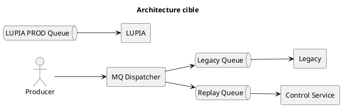
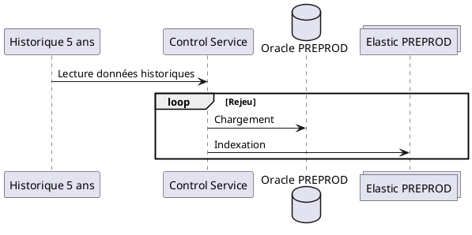
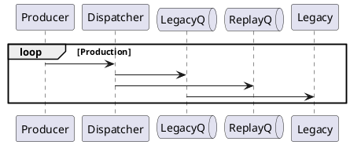
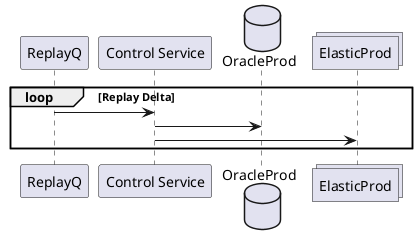
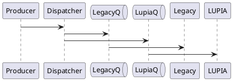
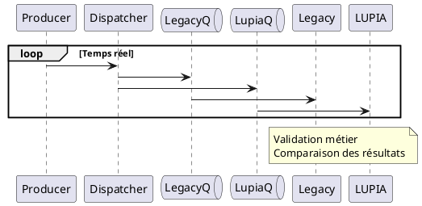
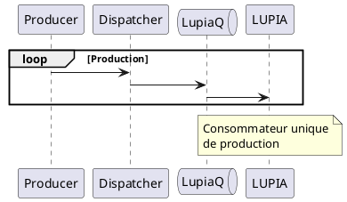

Je te propose une structure de DAT orientée **Architecture / Infra / MQ / Exploitation** qui présente :

* le contexte ;
* les hypothèses ;
* les prérequis ;
* les choix d'architecture ;
* **2 scénarios complets** ;
* les diagrammes d'architecture ;
* les diagrammes de séquence détaillés par phase ;
* la recommandation d'architecture.

***

# Chapitre DAT : Stratégie de Rejeu, Synchronisation Delta et Cutover

## 1. Contexte

Le projet LUPIA remplace progressivement la solution Legacy actuellement utilisée en production.

La migration nécessite :

* le rejeu d'un historique de 5 années ;
* la reconstruction complète des données Oracle ;
* la reconstruction complète des index Elasticsearch ;
* la continuité de service du Legacy ;
* l'absence de perte de messages ;
* la possibilité d'un rollback.

Le rejeu complet est estimé à environ **10 jours**.

Pendant cette période, la production continue de générer de nouveaux événements.

***

# 2. Objectifs

## Objectifs fonctionnels

* Reconstituer l'état historique du système.
* Maintenir la continuité de service.
* Garantir la cohérence des données.
* Permettre une validation métier avant bascule.

## Objectifs techniques

* Zéro perte de message.
* Zéro interruption de service.
* Possibilité de rollback.
* Contrôle du backlog MQ.

***

# 3. Scénarios étudiés

Deux scénarios ont été étudiés.

## Scénario A

Utilisation d'une unique file LUPIA.

```text
Producer
   |
Dispatcher
   |
   +--> Legacy Queue
   |
   +--> LUPIA Queue
```

La file LUPIA stocke l'ensemble des messages pendant la durée du rejeu.

***

## Scénario B

Utilisation d'une Replay Queue dédiée.

```text
Producer
   |
Dispatcher
   |
   +--> Legacy Queue
   |
   +--> Replay Queue
```

Après synchronisation :

```text
Producer
   |
Dispatcher
   |
   +--> Legacy Queue
   |
   +--> LUPIA PROD Queue
```

***

# 4. Analyse comparative

## Scénario A : Queue unique

### Avantages

* Architecture simple
* Peu de composants
* Configuration MQ réduite

### Inconvénients

* Backlog potentiel de plus de 10 jours
* File de production utilisée comme file de migration
* Monitoring plus complexe
* Risque opérationnel accru

***

## Scénario B : Replay Queue dédiée

### Avantages

* Séparation claire migration / production
* Meilleure visibilité opérationnelle
* File dédiée à la migration
* Plus simple à expliquer aux équipes Infrastructure

### Inconvénients

* Une file MQ supplémentaire

***

## Recommandation

Compte tenu :

* du rejeu de 10 jours ;
* de la volumétrie attendue ;
* de la nécessité de superviser la migration ;

le scénario B est recommandé.

***

# 5. Architecture cible retenue



***

# 6. Phase 1 : Rejeu Historique

## Objectif

Reconstruction des données sur les 5 dernières années.

## Diagramme



***

# 7. Phase 2 : Capture des nouveaux évènements

Pendant les 10 jours de rejeu.

## Diagramme



***

# 8. Phase 3 : Snapshot PREPROD

## Objectif

Créer une image cohérente de référence.

### Oracle

```text
Oracle PREPROD
      ↓
Backup Oracle
```

### Elasticsearch

```text
Elastic PREPROD
      ↓
Snapshot Elastic
```

***

# 9. Phase 4 : Restore PROD

## Oracle

```text
Backup Oracle
      ↓
Oracle PROD
```

## Elasticsearch

```text
Snapshot Elastic
      ↓
Elastic PROD
```

***

# 10. Phase 5 : Déploiement LUPIA en Production

## Composants

* Frontend
* Backend
* Control Service

## Etat

| Composant        | Etat         |
| ---------------- | ------------ |
| Legacy           | Actif        |
| Replay Queue     | Active       |
| LUPIA            | Déployée     |
| LUPIA PROD Queue | Non utilisée |

***

# 11. Phase 6 : Consommation de la Replay Queue

## Objectif

Rattraper tous les événements générés pendant les 10 jours de rejeu.

## Diagramme



***

# 12. Condition de fin du rejeu

Les critères suivants doivent être remplis :

```text
Replay Queue = vide
```

et

```text
Oracle synchronisé
```

et

```text
Elastic synchronisé
```

***

# 13. Phase 7 : Ouverture du temps réel LUPIA

Le dispatcher est reconfiguré :



***

# 14. Phase 8 : Coexistence

## Objectif

Valider le comportement de LUPIA sur des flux réels.

## Contrôles

* volumétrie Oracle ;
* volumétrie Elastic ;
* recherches ;
* traitements métier ;
* performances.

## Diagramme



***

# 15. Phase 9 : Cutover

## Actions

1. Validation métier.
2. Arrêt Listener Legacy.
3. Suppression Replay Queue.
4. Conservation LUPIA PROD Queue.

## Diagramme



***

# 16. Diagramme de séquence global (Scénario recommandé)

```plantuml
@startuml
title Migration complète LUPIA - Scénario recommandé

autonumber

actor Producer

participant Dispatcher

queue LegacyQ
queue ReplayQ
queue LupiaQ

participant Legacy
participant "Control Service" as CS

database OraclePP
collections ElasticPP

database OracleProd
collections ElasticProd

participant LUPIA

== Rejeu historique (10 jours) ==

CS -> OraclePP : Chargement historique 5 ans
CS -> ElasticPP : Réindexation complète

== Capture Replay ==

loop Production

Producer -> Dispatcher

Dispatcher -> LegacyQ
Dispatcher -> ReplayQ

LegacyQ -> Legacy

end

== Snapshot PREPROD ==

OraclePP -> OracleProd : Backup / Restore
ElasticPP -> ElasticProd : Snapshot / Restore

== Déploiement LUPIA PROD ==

create LUPIA

== Consommation Replay Queue ==

loop Replay Delta

ReplayQ -> CS

CS -> OracleProd
CS -> ElasticProd

end

== Replay terminé ==

note over ReplayQ
Backlog = 0
end note

== Activation temps réel ==

Producer -> Dispatcher

Dispatcher -> LegacyQ
Dispatcher -> LupiaQ

== Coexistence ==

loop Temps réel

LegacyQ -> Legacy
LupiaQ -> LUPIA

end

== Validation ==

note over Legacy,LUPIA
Validation Métier
end note

== Cutover ==

Legacy -> Legacy : Arrêt Listener

loop Temps réel

Producer -> Dispatcher
Dispatcher -> LupiaQ

LupiaQ -> LUPIA

end

@enduml
```

***

# 17. Stratégie de rollback

Tant que le cutover n'est pas validé :

* le Legacy reste actif ;
* les flux producteurs continuent à alimenter le Legacy ;
* la bascule peut être annulée.

Procédure :

1. Arrêt LUPIA.
2. Arrêt alimentation LUPIA Queue.
3. Maintien Legacy.
4. Analyse.
5. Nouvelle tentative de migration.

***

# 18. Points de vigilance Infrastructure

* Capacité disque MQ.
* Taille maximale Replay Queue.
* Temps de rétention MQ.
* Débit moyen de production.
* Débit de consommation du rejeu.
* Durée de restore Oracle.
* Durée de restore Elastic.
* Monitoring du backlog Replay Queue.
* Validation de la règle :

> Le débit de consommation du replay doit être supérieur au débit de production afin de garantir le rattrapage du retard avant le passage au temps réel.
