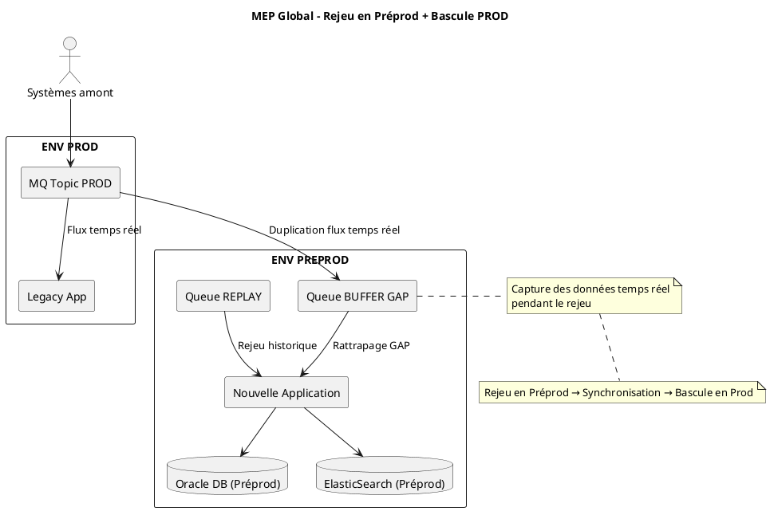
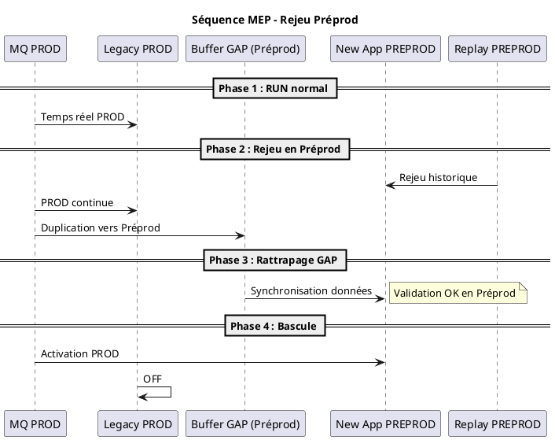
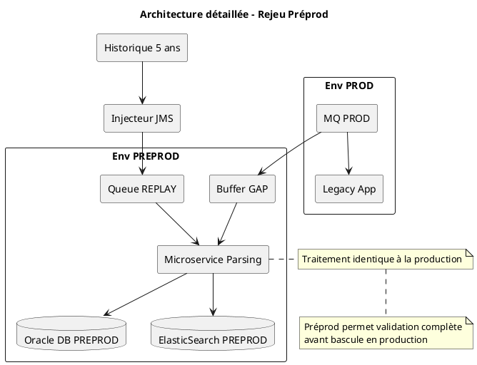

Excellente évolution 👍 — et c’est une **décision infra très structurante**.

👉 Le fait de faire le rejeu en **Préprod** change légèrement la lecture des diagrammes, mais surtout **renforce la robustesse MEP** → tu passes en stratégie encore plus “enterprise-grade”.

Je vais te fournir les **diagrammes PlantUML mis à jour**, en intégrant clairement :

✅ séparation Préprod / Prod  
✅ rejeu uniquement en Préprod  
✅ bascule finale vers Prod  
✅ gestion du GAP cohérente

***

# 🧩 ✅ 1. Diagramme GLOBAL — avec Préprod / Prod séparés

👉 🔥 **Version MEP réaliste (très propre comité client)**

***

# 🔄 ✅ 2. Diagramme SÉQUENTIEL — avec Préprod

👉 👉 parfait pour ton storytelling client

***

# ⚙️ ✅ 3. Diagramme ARCHITECTURE DÉTAILLÉ — flux complet

👉 👉 utile pour DAT + technique

***

# 🎯 🎯 CE QUE ÇA CHANGE (important à dire au client)

👉 Tu dois ABSOLUMENT expliquer ça 👇

***

## ✅ Message clé

> **“Le rejeu est isolé en environnement Préproduction pour éviter tout impact sur le système en production, tout en permettant de valider complètement les données avant bascule.”**

***

## ✅ Bénéfices

✔ aucun risque production  
✔ validation complète avant mise en service  
✔ tests réalistes  
✔ rollback facile

***

## ⚠️ Point d’attention (très important)

👉 il FAUT que :

*   GAP soit bien géré ✅
*   synchronisation finale soit complète ✅
*   cohérence Préprod = Prod ✅

***

# 🎤 ✅ Comment l’expliquer en réunion (important)

👉 phrase parfaite :

> **“Nous séparons totalement la phase de rejeu en Préproduction afin de protéger la production. Une fois les données validées et synchronisées, nous effectuons une bascule contrôlée vers la production.”**

***

# 💡 ✅ Phrase architecte

> **“La Préproduction devient un environnement de reconstruction complète et de validation avant activation.”**

***

# 🚀 Si tu veux aller encore plus loin

Je peux te générer :

✅ version PNG design de ces diagrammes (prêt PPT)  
✅ slide PowerPoint intégrée automatiquement  
✅ version draw\.io multi-env encore plus visuelle  
✅ script + animation EXACT pour ces diagrammes

***

👉 Dis-moi 👍
