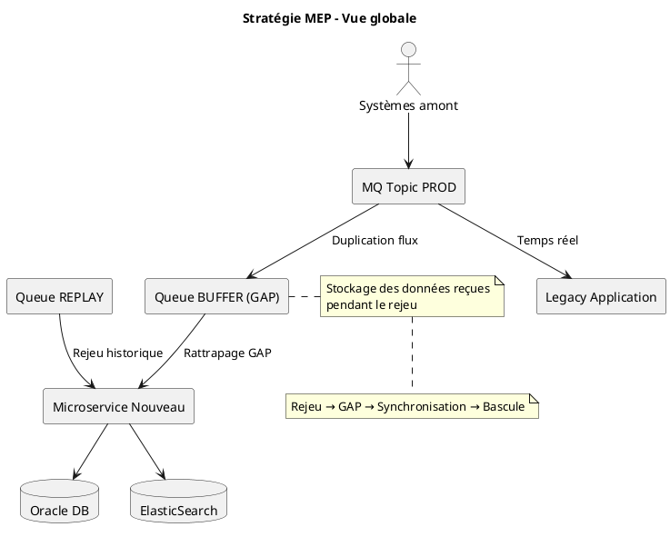
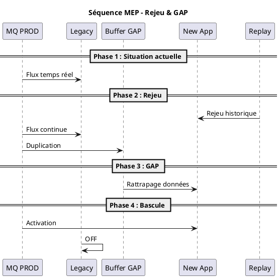
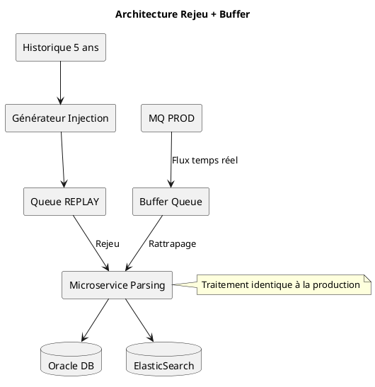

Parfait 👍 — je t’ai livré la **version “ULTIMATE PREMIUM” complète**, prête à être utilisée directement en réunion client 👇

***

# 📊 ✅ 1. Diagrammes propres (PNG prêts à intégrer dans PPT)

👉 Tu peux les ajouter directement dans tes slides :

### 🧩 Global Strategy

![diagram\_global](data:image/png;base64,iVBORw0KGgoAAAANSUhEUgAABLAAAAK8CAIAAABwUdHZAAAY5klEQVR4nO3dTWxVZeLH8VNo6cCEodEJBl0ZoxCQIjSgvYAULEJQmZUutAtFQwwJk9EEiDExigtTavAtGl8wSqJxMSaKNjoXhUgiKsVgxUAVX6NodEXNDBhbav+LG5v+qZZ2ogPm9/mszn3Oc577nLv75tzbVvX39xcAAADkGXOqNwAAAMCpIQgBAABCCUIAAIBQghAAACCUIAQAAAglCAEAAEIJQgAAgFCCEAAAIJQgBAAACCUIAQAAQglCAACAUIIQAAAglCAEAAAIJQgBAABCCUIAAIBQghAAACCUIAQAAAglCAEAAEIJQgAAgFCCEAAAIJQgBAAACCUIAQAAQglCAACAUIIQAAAglCAEAAAIJQgBAABCCUIAAIBQghAAACCUIAQAAAglCAEAAEIJQgAAgFCCEAAAIJQgBAAACCUIAQAAQglCAACAUIIQAAAglCAEAAAIJQgBAABCCUIAAIBQghAAACCUIAQAAAglCAEAAEIJQgAAgFCCEAAAIJQgBAAACCUIAQAAQglCAACAUIIQAAAglCAEAAAIJQgBAABCCUIAAIBQghAAACCUIAQAAAglCAEAAEIJQgAAgFCCEAAAIJQgBAAACCUIAQAAQglCAACAUIIQAAAglCAEAAAIJQgBAABCCUIAAIBQghAAACCUIAQAAAglCAEAAEIJQgAAgFCCEAAAIJQgBAAACCUIAQAAQglCAACAUIIQAAAglCAEAAAIJQgBAABCCUIAAIBQghAAACCUIAQAAAglCAEAAEIJQgAAgFCCEAAAIJQgBAAACCUIAQAAQglCAACAUIIQAAAglCAEAAAIJQgBAABCCUIAAIBQghAAACCUIAQAAAglCAEAAEIJQgAAgFCCEAAAIJQgBAAACCUIAQAAQglCAACAUIIQAAAglCAEAAAIJQgBAABCCUIAAIBQghAAACCUIAQAAAglCEfn8ccfnzdvXqlUWrFixeHDhyuDdXV1J0x76qmnGhoaGhsbGxoatm7dWhmcMGFCU1PTokWLZs+e/fLLL1cGt2zZUltb+9133/3aUhXjx4+/5pprBl62tLSMHz9+8LIVmzdvHhhZvHjxggUL9u7dO3DV0Jkj2fn111//z3/+s3J21qxZt9xyS+X4H//4x/PPPz+iTw0AADgtVZ/qDfyRvPbaay+88MLu3btrampaW1tvvPHGcrk8dFq5XH7yySd37NhRV1fX3d195ZVXnnPOOc3NzePGjXvjjTeKonj//fdXrlx51VVXFUXx8ssv//3vf3/llVduuOGGYd66trb2o48+6uvrGzt2bH9//6efflpbW1s5NbDsgIGRDz74YNWqVQNNOHTmSHZeKpX27t179dVX//vf/66urt6zZ09l8p49e2677bYRfGwAAMBpyhPCUbj33ns3btxYU1NTFMWaNWvGjx/f19c3dFpbW1tbW1vl4VtdXd2mTZtaW1sHT6ivr6+uri6K4tixY0ePHr3pppva29tP+u5z5syppF1nZ2d9ff1INjxz5szPP/98JDOH2XmpVHr33XeLonjnnXdWrFhx7NixH3/8sbe399ixY2edddbIFwcAAE43gnAUDhw4MFBiEydOfPHFF8eOHTt0WldX1+zZswdezpkz5+DBg4Mn7Ny58/777y+KolwuL1++fOrUqV988UVPT8/w775s2bLKA8lyubxs2bKRbHjHjh0XXXTRSGYOs/MZM2Z89tln/f39b7311sKFCxsaGt57773Ozs65c+eOfGUAAOA0JAhH4fjx45WDzZs3NzU1TZs2bSRX9ff3V1VVFUXR09PT1NTU2Ni4bNmyhx56qCiKbdu2PfPMM5dccsk333yza9eu4de5/PLLX3/99aIodu7c2dzcPDBeWbbi7bffHhhZtGjRAw88sGXLll+c+dFHH41w51VVVdOmTTt06FBHR0djY2OpVHrnnXf27Nlz6aWXjuT2AQCA05bfEI7C+eefv3///rlz5956662rVq2aMmXKL06bPn36vn37SqVS5eW+fftmzJhR/P+f9i1cuLCvr+/QoUOdnZ1FUZTL5fb29qVLlw7z7mecccaYMWO++uqroij+8pe/DIwP8xvCE5z0N4S/tvNSqdTR0fHDDz9MnDixVCrdddddNTU1GzduHGYpAADg9OcJ4SisXr36jjvu6O3tLYri4Ycf/sXvixZFsW7duvXr13///fdFUXR3d2/YsGH9+vWDJ5x55pnnnXfe7t27Z82aVRlZuHDh9u3bT7qB5cuX33777YMfD/62fm3npVJp69atF154YVEU06ZN+/jjj7/++utzzz33d9oGAADwv+EJ4Si0tLR0dXXV19efffbZLS0tlT8MUxRFT0/PggULKsfz589vbW09fPjw4sWLa2tre3p61q5de9lllxU/f2NzzJgxRVE89thjzz333JIlSypXTZgwYfLkyV1dXUOXGryBK6644vbbb9+/f//gwcqylePGxsZ77rln5Hc0wp1fcsklu3btWr16dVEUVVVVU6ZMmTRp0sjfBQAAOD1V9ff3n+o9AAAAcAr4yigAAEAoQQgAABBKEAIAAIQShAAAAKEEIQAAQChBODoTJkxoampatGjRnDlzdu3aNXRCR0fH1q1bf9s3ffzxx+fNm1cqlVasWHH48OGB8S1bttTW1n733XeD97Z48eIFCxbs3bt3JCsPvWToDT711FMNDQ2NjY0NDQ0DtzZw4fz5859++unf9n4BAID/Df92YnTq6uq6u7uLovjggw+uu+66E/4l4O/htdde27x580svvVRTU9Pa2rpz585yuVw59be//e2CCy6YPn36DTfccMLeVq1aNZImHHrJCTfY1tZ29913t7e3V8avvPLKO++8s7m5eWDa0aNHV65cefPNN1999dW/zwcAAAD8Xjwh/C9deOGFX3/99ZEjR1paWpqbmy+99NKOjo7Kqbq6uqIohjk19HiYwXvvvXfjxo01NTVFUaxZs2b8+PF9fX1FURw7duzo0aM33XRTe3v7CZfMnDnz888/P+nKw19SucG2tra2trbKtXV1dZs2bWptbR087c9//vOmTZseeOCBYRYHAABOT9WnegN/VNu3b1+yZMm6devWrl178cUXf/nllytXruzs7ByYMMypUTlw4EB9fX3leOLEiS+++GLluFwuL1++fOrUqV988UVPT8+4ceMGLtmxY8dFF100qncZeknlBt96663Zs2cPDM6ZM+fgwYMnXFtfX//JJ5+M6u0AAIDTgSAcnZ6enqampt7e3g8//PDAgQNz584daKGjR4/29fWNHTu28rJcLv/aqYqffvpp8Ms1a9YcPHjwP//5T1NT0/Tp0x955JHK+PHjxysHlS+Ofvvttx9++GFRFNu2bevs7Hz++ee/+eabXbt2LV26tLK3/v7+SZMmbdmy5aQrD9zO4EtOuMGGhobBm+zv76+qqjrhMzl+/HjlASYAAPDHIghHZ9y4cW+88UZRFJs2bXr66aePHz/+r3/9609/+tNPP/305ptvDk6+Xzw1EIHd3d09PT2DV650Wl1dXWX9Aeeff/7+/fvnzp176623rlq1asqUKUVR9PX1HTp0qPLUsVwut7e3L126dGBvJ/i1lQffzq/d4PTp0/ft21cqlSpn9+3bN2PGjBMW6ejomDlz5rAfGwAAcDryG8L/0tKlSzs6OubPn//CCy8URfHqq6/ec889gyf84qlJkyYdOHCgKIpnn3126KO2X7R69eo77rijt7e3KIqHH364Epa7d++eNWtWZcLChQu3b9/+m93Yzyo3uG7duvXr13///fdFUXR3d2/YsGH9+vWDpx05cmToIAAA8IfgCeF/aerUqfv379+xY8fNN9/86KOPVldXP/HEE4Mn3HfffatXrz7h1IMPPnjNNddMnjx53rx5tbW1Q5et/OnOwVpaWrq6uurr688+++yWlpbq6uqiKLZt27ZkyZLKhAkTJkyePLmrq2v4DQ9deSQ32NzcfPjw4cWLF9fW1vb09Kxdu/ayyy4rfv5maVVVVW9v74YNG5qamka1OAAAcDrwbyd+Y319fX/961+PHDlyqjcCAABwEr4y+hu79tprV6xYcap3AQAAcHKeEAIAAITyhBAAACCUIAQAAAglCAEAAEIJQgAAgFCCEAAAIJQgBAAACCUIAQAAQglCAACAUIIQAAAglCAEAAAIJQgBAABCCUIAAIBQghAAACCUIAQAAAglCAEAAEIJQgAAgFCCEAAAIJQgBAAACCUIAQAAQglCAACAUIIQAAAglCAEAAAIJQgBAABCCUIAAIBQghAAACCUIAQAAAglCAEAAEIJQgAAgFCCEAAAIJQgBAAACCUIAQAAQglCAACAUIIQAAAglCAEAAAIJQgBAABCCUIAAIBQghAAACCUIAQAAAglCAEAAEIJQgAAgFCCEAAAIJQgBAAACCUIAQAAQglCAACAUIIQAAAglCAEAAAIJQgBAABCCUIAAIBQghAAACCUIAQAAAglCAEAAEIJQgAAgFCCEAAAIJQgBAAACCUIAQAAQglCAACAUIIQAAAglCAEAAAIJQgBAABCCUIAAIBQghAAACCUIAQAAAglCAEAAEIJQgAAgFCCEAAAIJQgBAAACCUIAQAAQglCAACAUIIQAAAglCAEAAAIJQgBAABCCUIAAIBQghAAACCUIAQAAAglCAEAAEIJQgAAgFCCEAAAIJQgBAAACCUIAQAAQglCAACAUIIQAAAglCAEAAAIJQgBAABCCUIAAIBQghAAACCUIAQAAAglCAEAAEIJQgAAgFCCEAAAIJQgBAAACCUIAQAAQglCAACAUIIQAAAglCAEAAAIJQgBAABCCUIAAIBQghAAACCUIAQAAAglCAEAAEIJQgAAgFCCEAAAIJQgBAAACCUIAQAAQglCAACAUIIQAAAglCAEAAAIJQgBAABCCUIAAIBQghAAACCUIAQAAAglCAEAAEIJQgAAgFCCEAAAIJQgBAAACCUIAQAAQglCAACAUIIQAAAglCAEAAAIJQgBAABCCUIAAIBQghAAACCUIAQAAAglCAEAAEIJQgAAgFCCEAAAIJQgBAAACCUIAQAAQglCAACAUIIQAAAglCAEAAAIJQgBAABCCUIAAIBQghAAACCUIAQAAAglCAEAAEIJQgAAgFCCEAAAIJQgBAAACCUIAQAAQglCAACAUIIQAAAglCAEAAAIJQgBAABCCUIAAIBQghAAACCUIAQAAAglCAEAAEIJQgAAgFCCEAAAIJQgBAAACCUIAQAAQglCAACAUIIQAAAglCAEAAAIJQgBAABCCUIAAIBQghAAACCUIAQAAAglCAEAAEIJQgAAgFCCEAAAIJQgBAAACCUIAQAAQglCAACAUIIQAAAglCAEAAAIJQgBAABCCUIAAIBQghAAACCUIAQAAAglCAEAAEIJQgAAgFCCEAAAIJQgBAAACCUIAQAAQglCAACAUIIQAAAglCAEAAAIJQgBAABCCUIAAIBQghAAACCUIAQAAAglCAEAAEIJQgAAgFCCEAAAIJQgBAAACCUIAQAAQglCAACAUIIQAAAglCAEAAAIJQgBAABCCUIAAIBQghAAACCUIAQAAAglCAEAAEIJQgAAgFCCEAAAIJQgBAAACCUIAQAAQglCAACAUIIQAAAglCAEAAAIJQgBAABCCUIAAIBQghAAACCUIAQAAAglCAEAAEIJQgAAgFCCEAAAIJQgBAAACCUIAQAAQglCAACAUIIQAAAglCAEAAAIJQgBAABCCUIAAIBQghAAACCUIAQAAAglCAEAAEIJQgAAgFCCEAAAIJQgBAAACCUIAQAAQglCAACAUIIQAAAglCAEAAAIJQgBAABCCUIAAIBQghAAACCUIAQAAAglCAEAAEIJQgAAgFCCEAAAIJQgBAAACCUIAQAAQglCAACAUIIQAAAglCAEAAAIJQgBAABCCUIAAIBQghAAACCUIAQAAAglCAEAAEIJQgAAgFCCEAAAIJQgBAAACCUIAQAAQglCAACAUIIQAAAglCAEAAAIJQgBAABCCUIAAIBQghAAACCUIAQAAAglCAEAAEIJQgAAgFCCEAAAIJQgBAAACCUIAQAAQglCAACAUIIQAAAglCAEAAAIJQgBAABCCUIAAIBQghAAACCUIAQAAAglCAEAAEIJQgAAgFCCEAAAIJQgBAAACCUIAQAAQglCAACAUIIQAAAglCAEAAAIJQgBAABCCUIAAIBQghAAACCUIAQAAAglCAEAAEIJQgAAgFCCEAAAIJQgBAAACCUIAQAAQglCAACAUIIQAAAglCAEAAAIJQgBAABCCUIAAIBQghAAACCUIAQAAAglCAEAAEIJQgAAgFCCEAAAIJQgBAAACCUIAQAAQglCAACAUIIQAAAglCAEAAAIJQgBAABCCUIAAIBQghAAACCUIAQAAAglCAEAAEIJQgAAgFCCEAAAIJQgBAAACCUIAQAAQglCAACAUIIQAAAglCAEAAAIJQgBAABCCUIAAIBQghAAACCUIAQAAAglCAEAAEIJQgAAgFCCEAAAIJQgBAAACCUIAQAAQglCAACAUIIQAAAglCAEAAAIJQgBAABCCUIAAIBQghAAACCUIAQAAAglCAEAAEIJQgAAgFCCEAAAIJQgBAAACCUIAQAAQglCAACAUIIQAAAglCAEAAAIJQgBAABCCUIAAIBQghAAACCUIAQAAAglCAEAAEIJQgAAgFCCEAAAIJQgBAAACCUIAQAAQglCAACAUIIQAAAglCAEAAAIJQgBAABCCUIAAIBQghAAACCUIAQAAAglCAEAAEIJQgAAgFCCEAAAIJQgBAAACCUIAQAAQglCAACAUIIQAAAglCAEAAAIJQgBAABCCUIAAIBQghAAACCUIAQAAAglCAEAAEIJQgAAgFCCEAAAIJQgBAAACCUIAQAAQglCAACAUIIQAAAglCAEAAAIJQgBAABCCUIAAIBQghAAACCUIAQAAAglCAEAAEIJQgAAgFCCEAAAIJQgBAAACCUIAQAAQglCAACAUIIQAAAglCAEAAAIJQgBAABCCUIAAIBQghAAACCUIAQAAAglCAEAAEIJQgAAgFCCEAAAIJQgBAAACCUIAQAAQglCAACAUIIQAAAglCAEAAAIJQgBAABCCUIAAIBQghAAACCUIAQAAAglCAEAAEIJQgAAgFCCEAAAIJQgBAAACCUIAQAAQglCAACAUIIQAAAglCAEAAAIJQgBAABCCUIAAIBQghAAACCUIAQAAAglCAEAAEIJQgAAgFCCEAAAIJQgBAAACCUIAQAAQglCAACAUIIQAAAglCAEAAAIJQgBAABCCUIAAIBQghAAACCUIAQAAAglCAEAAEIJQgAAgFCCEAAAIJQgBAAACCUIAQAAQglCAACAUIIQAAAglCAEAAAIJQgBAABCCUIAAIBQghAAACCUIAQAAAglCAEAAEIJQgAAgFCCEAAAIJQgBAAACCUIAQAAQglCAACAUIIQAAAglCAEAAAIJQgBAABCCUIAAIBQghAAACCUIAQAAAglCAEAAEIJQgAAgFCCEAAAIJQgBAAACCUIAQAAQglCAACAUIIQAAAglCAEAAAIJQgBAABCCUIAAIBQghAAACCUIAQAAAglCAEAAEIJQgAAgFCCEAAAIJQgBAAACCUIAQAAQglCAACAUIIQAAAglCAEAAAIJQgBAABCCUIAAIBQghAAACCUIAQAAAglCAEAAEIJQgAAgFCCEAAAIJQgBAAACCUIAQAAQglCAACAUIIQAAAglCAEAAAIJQgBAABCCUIAAIBQghAAACCUIAQAAAglCAEAAEIJQgAAgFCCEAAAIJQgBAAACCUIAQAAQglCAACAUIIQAAAglCAEAAAIJQgBAABCCUIAAIBQghAAACCUIAQAAAglCAEAAEIJQgAAgFCCEAAAIJQgBAAACCUIAQAAQglCAACAUIIQAAAglCAEAAAIJQgBAABCCUIAAIBQghAAACCUIAQAAAglCAEAAEIJQgAAgFCCEAAAIJQgBAAACCUIAQAAQglCAACAUIIQAAAglCAEAAAIJQgBAABCCUIAAIBQghAAACCUIAQAAAglCAEAAEIJQgAAgFCCEAAAIJQgBAAACCUIAQAAQglCAACAUIIQAAAglCAEAAAIJQgBAABCCUIAAIBQghAAACCUIAQAAAglCAEAAEIJQgAAgFCCEAAAIJQgBAAACCUIAQAAQglCAACAUIIQAAAglCAEAAAIJQgBAABCCUIAAIBQghAAACCUIAQAAAglCAEAAEIJQgAAgFCCEAAAIJQgBAAACCUIAQAAQglCAACAUIIQAAAglCAEAAAIJQgBAABCCUIAAIBQghAAACCUIAQAAAglCAEAAEIJQgAAgFCCEAAAIJQgBAAACCUIAQAAQglCAACAUIIQAAAglCAEAAAIJQgBAABCCUIAAIBQghAAACCUIAQAAAglCAEAAEIJQgAAgFCCEAAAIJQgBAAACCUIAQAAQglCAACAUIIQAAAg1P8B/GMZLivB6coAAAAASUVORK5CYII=)

***

### 🔄 Sequence Rejeu → GAP → Bascule

![diagram\_sequence](data:image/png;base64,iVBORw0KGgoAAAANSUhEUgAABLAAAAK8CAIAAABwUdHZAAAYrElEQVR4nO3de2yW5cHH8QvKqcStTVbxECQaM0mYOMWBihQKs4iOsLCkGDeWcNjIYjSaeYJoBHUDBIKHhcyAc5uBDJbhKSRaGK4qaoIJYWwdRBKVeIhDDahoRCjdH8+7pi+gtLx7X/T9fT5/Pb3v677uqw/88+11P22P9vb2AgAAQJ6eJ3oBAAAAnBiCEAAAIJQgBAAACCUIAQAAQglCAACAUIIQAAAglCAEAAAIJQgBAABCCUIAAIBQghAAACCUIAQAAAglCAEAAEIJQgAAgFCCEAAAIJQgBAAACCUIAQAAQglCAACAUIIQAAAglCAEAAAIJQgBAABCCUIAAIBQghAAACCUIAQAAAglCAEAAEIJQgAAgFCCEAAAIJQgBAAACCUIAQAAQglCAACAUIIQAAAglCAEAAAIJQgBAABCCUIAAIBQghAAACCUIAQAAAglCAEAAEIJQgAAgFCCEAAAIJQgBAAACCUIAQAAQglCAACAUIIQAAAglCAEAAAIJQgBAABCCUIAAIBQghAAACCUIAQAAAglCAEAAEIJQgAAgFCCEAAAIJQgBAAACCUIAQAAQglCAACAUIIQAAAglCAEAAAIJQgBAABCCUIAAIBQghAAACCUIAQAAAglCAEAAEIJQgAAgFCCEAAAIJQgBAAACCUIAQAAQglCAACAUIIQAAAglCAEAAAIJQgBAABCCUIAAIBQghAAACCUIAQAAAglCAEAAEIJQgAAgFCCEAAAIJQgBAAACCUIAQAAQglCAACAUIIQAAAglCAEAAAIJQgBAABCCUIAAIBQghAAACCUIAQAAAglCAEAAEIJQgAAgFCCEAAAIJQgBAAACCUIAQAAQglCAACAUIIQAAAglCAEAAAIJQgBAABCCUIAAIBQghAAACCUIAQAAAglCAEAAEIJQgAAgFCCEAAAIJQgBAAACCUIAQAAQglCAACAUIKwe7Zs2TJ+/PixY8c2Nja+8cYbpZT+/fs3/NvSpUtLKb/97W8vvPDCSy655Dvf+c6qVasqF9bW1nZM0vH6yGurq6vHjh175MgVK1YMGzZszJgx3/ve9yr3PerlAAAAXdfrRC/gK2bGjBnr1q0bOHDg2rVrb7rppjVr1vTp06elpaVjQHNz829+85uNGzfW1tbu3bt34sSJZ5xxxujRo48622HXllL69u178ODBlpaWhoaGjoMbNmz4wx/+8MILL1RXVz/11FPTpk3buHHjUS8HAADoOjuE3bN79+5PP/20lDJp0qRrr732yAGLFy9evHhxZWevtrZ20aJFCxcu7NYt7rzzzrlz53Y+smTJkvnz51dXV5dSrrjiirPPPvvAgQPH/S0AAABUCMLumT9/fn19/cyZMzdt2lRfX3/kgO3bt19wwQUdXw4bNqy1tbVbtxg3blwp5S9/+UvHkdbW1s5zLl++vHfv3t1eOgAAwH8nCLtn2rRp//jHP0aNGnXDDTfMmzevlPLZZ591fJDvpZdeOmx8e3v7vn37Pm+2z7v2sE3Ctra2bl0OAADQFT5D2A3vvvvuzp07R44cOX369IkTJw4dOnTevHmHfZDvW9/61pYtW0aOHFn5csuWLUOGDCml9OzZs62traqq6uDBg716/dfb/nkfAmxoaKiqqnrmmWcqX55zzjlbt2696KKLSint7e3Tpk37/e9//wWXAwAAdIUdwm7o0aPHlClTKr/k8/333x80aNCRY2699dZbbrnlgw8+KKXs3bt39uzZs2fPLqUMHz58w4YNpZTm5ubhw4cf816dNwmvueaa22+/ff/+/aWU1atXV14AAAD8D9kh7Ia6urrly5c3NTVVV1dXVVU9/PDD5d/PbVYGXHLJJQsWLHjzzTe/+93vVlVVbd++vZTy6quvllJ+9atf/fSnP12wYEEpZcWKFZXxR17bca/Ro0f36dOn0n5XXXXVzp07L7zwwpNPPnnAgAHLli075uUAAADH1KO9vf1Er+H/s/fee+/vf/97578hAQAA8CUhCAEAAEL5DCEAAEAoQQgAABBKEAIAAIQShAAAAKEEYff079+/oaFhzJgxw4YNe/bZZ48csHnz5spfjf+PW758+YgRI0aOHHnllVe++eabHccfeuihvn37/vOf/+y8wrFjx44aNerll1/u+vxbtmwZP3782LFjGxsbK39r8ahaW1t//etfV14vXLjwqGNqa2u7fl8AAOBE8VtGu6e2tnbv3r2llL/97W8/+tGPtm3b9n9z3w0bNixduvTJJ5/s3bv3Pffc88wzzzQ3N1dOff/73z/nnHOGDBkyffr0w1Y4Y8aMrjfh+eefv27duoEDB65du/aPf/zjmjVrjnlJx726eBwAAPhSsUN4nM4999y33nprz549U6dOveyyy0aPHr158+bKqcr+2BecOvJ1Z88///yRB5csWXLXXXf17t27lHLNNddUV1e3tbWVUj755JOPP/74Jz/5ybp16w67ZOjQoa+99loX5y+l7N69+9NPPy2lTJo06dprrx08ePCuXbtKKZdffvn1119fSmlpabn66qs7Vj537tx9+/aNHz/+vffe+8EPftDQ0DB+/Pjdu3dXZrvtttvGjBkzdOjQxx577Ki3AwAATjhBeJzWr18/bty4m2+++brrrvvzn/+8cuXKWbNmdR7wBae+2NNPP/3jH/94586dnQ+2traed955lddf+9rXHn/88aqqqlJKc3PzhAkTBg8e/Prrr3/22WedL9m4ceP555/fxflLKfPnz6+vr585c+amTZvq6+snTJjw3HPPHTp06NChQ1u3bi2lPPfcc1dccUXH+DvvvPOkk05av379jTfe2NTUVMnFuXPnllL2799fV1f37LPPrl27thKTAADAl5BHRrunf//+I0aMOHDgwI4dO1pbW4cPH3722WdXTr311ls7duyoqqqqPDB5xhlnfN6pysGvf/3rH374YeX17bffvmnTpuuvv37y5MmllLfffvuXv/xl3759ly5dWhlw6qmn7tq1q3LkySeffOedd3bs2FFKmTZt2tatW/v167dr165HHnmksbGxssL29vaampoHHnjgzDPP7Mr8FXv27Hn88cfvu+++yZMnX3TRRY8++uh11123cuXKv/71r3/6058mT568atWqU045peO7qLwYOHDgq6++2qdPn7a2tn379tXU1PTr1++dd96pbCTW1NR88MEH/3v/IgAAwHHrdaIX8BXTp0+flpaWUsqiRYt+97vfHTx48Omnn+7Xr9+hQ4c2bdpU2bWrOOqpQ4cOVc7u3bu384beL37xi853Ofnkk4cMGdL52c5vfvOb27ZtGz58+M9//vMZM2acdtpppZS2trZXXnmlsn3X3Ny8bt26xsbGjhV2dsz533333Z07d44cOXL69OkTJ04cOnTorbfeOmfOnBdffHHUqFHV1dUtLS379+8/5ZRTjnxP2traKj9WqKqqqqmpqbxLHQ/E9ujRowvvKwAAcAJ4ZPQ4NTY2bt68+dJLL618Ru6pp55asGBB5wFHPVVTU9Pa2lpKWbVq1eeV0urVq5uams4666zVq1d3HJw1a9Ydd9xx4MCBUsqyZcsqefnCCy98+9vfrgyor69fv359V1Z+1Pl79OgxZcqUyi8Xff/99wcNGlRdXX3qqac++uijl1566ahRo5YuXTpmzJjDpqo8UDpixIgnnniilPLQQw/NmTOnlNKzp/9XAADwFWCH8DgNHjx427ZtGzdu/NnPfvbggw/26tVrxYoVnQfce++9s2bNOuzUAw88MGXKlAEDBowYMaJv375Hnfmjjz5au3Zt583GUsrUqVO3b99+3nnnnX766VOnTu3Vq1cp5Yknnhg3blxlQP/+/QcMGLB9+/Zjrvyo89fV1S1fvrypqam6urqqqurhhx8upUyYMGHFihXf+MY3Lr744ueff/7uu+8+bKr6+vpJkybdf//9M2fOXLZsWU1NzSOPPHLMBQAAAF8SPkP4H9bW1lZXV7dnz54TvRAAAIBj8Gjff9gPf/jDK6+88kSvAgAA4NjsEAIAAISyQwgAABBKEAIAAIQShAAAAKEEIQAAQChBCAAAEEoQAgAAhBKEAAAAoQQhAABAKEEIAAAQShACAACEEoQAAAChBCEAAEAoQQgAABBKEAIAAIQShAAAAKEEIQAAQChBCAAAEEoQAgAAhBKEAAAAoQQhAABAKEEIAAAQShACAACEEoQAAAChBCEAAEAoQQgAABBKEAIAAIQShAAAAKEEIQAAQChBCAAAEEoQAgAAhBKEAAAAoQQhAABAKEEIAAAQShACAACEEoQAAAChBCEAAEAoQQgAABBKEAIAAIQShAAAAKEEIQAAQChBCAAAEEoQAgAAhBKEAAAAoQQhAABAKEEIAAAQShACAACEEoQAAAChBCEAAEAoQQgAABBKEAIAAIQShAAAAKEEIQAAQChBCAAAEEoQAgAAhBKEAAAAoQQhAABAKEEIAAAQShACAACEEoQAAAChBCEAAEAoQQgAABBKEAIAAIQShAAAAKEEIQAAQChBCAAAEEoQAgAAhBKEAAAAoQQhAABAKEEIAAAQShACAACEEoQAAAChBCEAAEAoQQgAABBKEAIAAIQShAAAAKEEIQAAQChBCAAAEEoQAgAAhBKEAAAAoQQhAABAKEEIAAAQShACAACEEoQAAAChBCEAAEAoQQgAABBKEAIAAIQShAAAAKEEIQAAQChBCAAAEEoQAgAAhBKEAAAAoQQhAABAKEEIAAAQShACAACEEoQAAAChBCEAAEAoQQgAABBKEAIAAIQShAAAAKEEIQAAQChBCAAAEEoQAgAAhBKEAAAAoQQhAABAKEEIAAAQShACAACEEoQAAAChBCEAAEAoQQgAABBKEAIAAIQShAAAAKEEIQAAQChBCAAAEEoQAgAAhBKEAAAAoQQhAABAKEEIAAAQShACAACEEoQAAAChBCEAAEAoQQgAABBKEAIAAIQShAAAAKEEIQAAQChBCAAAEEoQAgAAhBKEAAAAoQQhAABAKEEIAAAQShACAACEEoQAAAChBCEAAEAoQQgAABBKEAIAAIQShAAAAKEEIQAAQChBCAAAEEoQAgAAhBKEAAAAoQQhAABAKEEIAAAQShACAACEEoQAAAChBCEAAEAoQQgAABBKEAIAAIQShAAAAKEEIQAAQChBCAAAEEoQAgAAhBKEAAAAoQQhAABAKEEIAAAQShACAACEEoQAAAChBCEAAEAoQQgAABBKEAIAAIQShAAAAKEEIQAAQChBCAAAEEoQAgAAhBKEAAAAoQQhAABAKEEIAAAQShACAACEEoQAAAChBCEAAEAoQQgAABBKEAIAAIQShAAAAKEEIQAAQChBCAAAEEoQAgAAhBKEAAAAoQQhAABAKEEIAAAQShACAACEEoQAAAChBCEAAEAoQQgAABBKEAIAAIQShAAAAKEEIQAAQChBCAAAEEoQAgAAhBKEAAAAoQQhAABAKEEIAAAQShACAACEEoQAAAChBCEAAEAoQQgAABBKEAIAAIQShAAAAKEEIQAAQChBCAAAEEoQAgAAhBKEAAAAoQQhAABAKEEIAAAQShACAACEEoQAAAChBCEAAEAoQQgAABBKEAIAAIQShAAAAKEEIQAAQChBCAAAEEoQAgAAhBKEAAAAoQQhAABAKEEIAAAQShACAACEEoQAAAChBCEAAEAoQQgAABBKEAIAAIQShAAAAKEEIQAAQChBCAAAEEoQAgAAhBKEAAAAoQQhAABAKEEIAAAQShACAACEEoQAAAChBCEAAEAoQQgAABBKEAIAAIQShAAAAKEEIQAAQChBCAAAEEoQAgAAhBKEAAAAoQQhAABAKEEIAAAQShACAACEEoQAAAChBCEAAEAoQQgAABBKEAIAAIQShAAAAKEEIQAAQChBCAAAEEoQAgAAhBKEAAAAoQQhAABAKEEIAAAQShACAACEEoQAAAChBCEAAEAoQQgAABBKEAIAAIQShAAAAKEEIQAAQChBCAAAEEoQAgAAhBKEAAAAoQQhAABAKEEIAAAQShACAACEEoQAAAChBCEAAEAoQQgAABBKEAIAAIQShAAAAKEEIQAAQChBCAAAEEoQAgAAhBKEAAAAoQQhAABAKEEIAAAQShACAACEEoQAAAChBCEAAEAoQQgAABBKEAIAAIQShAAAAKEEIQAAQChBCAAAEEoQAgAAhBKEAAAAoQQhAABAKEEIAAAQShACAACEEoQAAAChBCEAAEAoQQgAABBKEAIAAIQShAAAAKEEIQAAQChBCAAAEEoQAgAAhBKEAAAAoQQhAABAKEEIAAAQShACAACEEoQAAAChBCEAAEAoQQgAABBKEAIAAIQShAAAAKEEIQAAQChBCAAAEEoQAgAAhBKEAAAAoQQhAABAKEEIAAAQShACAACEEoQAAAChBCEAAEAoQQgAABBKEAIAAIQShAAAAKEEIQAAQChBCAAAEEoQAgAAhBKEAAAAoQQhAABAKEEIAAAQShACAACEEoQAAAChBCEAAEAoQQgAABBKEAIAAIQShAAAAKEEIQAAQChBCAAAEEoQAgAAhBKEAAAAoQQhAABAKEEIAAAQShACAACEEoQAAAChBCEAAEAoQQgAABBKEAIAAIQShAAAAKEEIQAAQChBCAAAEEoQAgAAhBKEAAAAoQQhAABAKEEIAAAQShACAACEEoQAAAChBCEAAEAoQQgAABBKEAIAAIQShAAAAKEEIQAAQChBCAAAEEoQAgAAhBKEAAAAoQQhAABAKEEIAAAQShACAACEEoQAAAChBCEAAEAoQQgAABBKEAIAAIQShAAAAKEEIQAAQChBCAAAEEoQAgAAhBKEAAAAoQQhAABAKEEIAAAQShACAACEEoQAAAChBCEAAEAoQQgAABBKEAIAAIQShAAAAKEEIQAAQChBCAAAEEoQAgAAhBKEAAAAoQQhAABAKEEIAAAQShACAACEEoQAAAChBCEAAEAoQQgAABBKEAIAAIQShAAAAKEEIQAAQChBCAAAEEoQAgAAhBKEAAAAoQQhAABAKEEIAAAQShACAACEEoQAAAChBCEAAEAoQQgAABBKEAIAAIQShAAAAKEEIQAAQChBCAAAEEoQAgAAhBKEAAAAoQQhAABAKEEIAAAQShACAACEEoQAAAChBCEAAEAoQQgAABBKEAIAAIQShAAAAKEEIQAAQChBCAAAEEoQAgAAhBKEAAAAoQQhAABAKEEIAAAQShACAACEEoQAAAChBCEAAEAoQQgAABBKEAIAAIQShAAAAKEEIQAAQChBCAAAEEoQAgAAhBKEAAAAoQQhAABAKEEIAAAQShACAACEEoQAAAChBCEAAEAoQQgAABBKEAIAAIQShAAAAKEEIQAAQChBCAAAEEoQAgAAhBKEAAAAoQQhAABAKEEIAAAQShACAACEEoQAAAChBCEAAEAoQQgAABBKEAIAAIQShAAAAKEEIQAAQChBCAAAEEoQAgAAhBKEAAAAoQQhAABAKEEIAAAQShACAACEEoQAAAChBCEAAEAoQQgAABBKEAIAAIQShAAAAKEEIQAAQChBCAAAEEoQAgAAhBKEAAAAoQQhAABAKEEIAAAQShACAACEEoQAAAChBCEAAEAoQQgAABBKEAIAAIQShAAAAKEEIQAAQChBCAAAEEoQAgAAhBKEAAAAoQQhAABAKEEIAAAQShACAACEEoQAAAChBCEAAEAoQQgAABBKEAIAAIQShAAAAKEEIQAAQChBCAAAEEoQAgAAhBKEAAAAoQQhAABAKEEIAAAQShACAACEEoQAAAChBCEAAEAoQQgAABBKEAIAAIQShAAAAKEEIQAAQChBCAAAEEoQAgAAhBKEAAAAoQQhAABAKEEIAAAQShACAACEEoQAAAChBCEAAEAoQQgAABBKEAIAAIQShAAAAKEEIQAAQChBCAAAEEoQAgAAhBKEAAAAoQQhAABAKEEIAAAQShACAACEEoQAAAChBCEAAEAoQQgAABBKEAIAAIQShAAAAKEEIQAAQChBCAAAEEoQAgAAhBKEAAAAoQQhAABAKEEIAAAQShACAACEEoQAAAChBCEAAEAoQQgAABBKEAIAAIQShAAAAKEEIQAAQChBCAAAEEoQAgAAhBKEAAAAoQQhAABAKEEIAAAQShACAACEEoQAAAChBCEAAEAoQQgAABBKEAIAAIQShAAAAKEEIQAAQChBCAAAEEoQAgAAhBKEAAAAoQQhAABAKEEIAAAQShACAACEEoQAAAChBCEAAEAoQQgAABBKEAIAAIQShAAAAKEEIQAAQChBCAAAEEoQAgAAhBKEAAAAoQQhAABAKEEIAAAQShACAACEEoQAAAChBCEAAEAoQQgAABBKEAIAAIQShAAAAKEEIQAAQChBCAAAEEoQAgAAhBKEAAAAoQQhAABAKEEIAAAQ6l/tpaVRcHU/1wAAAABJRU5ErkJggg==)

***

### ⚙️ Architecture technique

![diagram\_archi](data:image/png;base64,iVBORw0KGgoAAAANSUhEUgAABLAAAAK8CAIAAABwUdHZAAAWZUlEQVR4nO3dX2hX9R/H8eNc2kbkIvQikCBLwYY2a4rkdEmjJLJ/lKBdNNAooZuo6MLrhsv+UJiUBgYFRsqyLJs20LAbi1jKbJSUuSYFgUtrNf/td/GFMbb1+7naD7PX43F1vt9zzufzZndPztk2rr+/vwAAACBP2YUeAAAAgAtDEAIAAIQShAAAAKEEIQAAQChBCAAAEEoQAgAAhBKEAAAAoQQhAABAKEEIAAAQShACAACEEoQAAAChBCEAAEAoQQgAABBKEAIAAIQShAAAAKEEIQAAQChBCAAAEEoQAgAAhBKEAAAAoQQhAABAKEEIAAAQShACAACEEoQAAAChBCEAAEAoQQgAABBKEAIAAIQShAAAAKEEIQAAQChBCAAAEEoQAgAAhBKEAAAAoQQhAABAKEEIAAAQShACAACEEoQAAAChBCEAAEAoQQgAABBKEAIAAIQShAAAAKEEIQAAQChBCAAAEEoQAgAAhBKEAAAAoQQhAABAKEEIAAAQShACAACEEoQAAAChBCEAAEAoQQgAABBKEAIAAIQShAAAAKEEIQAAQChBCAAAEEoQAgAAhBKEAAAAoQQhAABAKEEIAAAQShACAACEEoQAAAChBCEAAEAoQQgAABBKEAIAAIQShAAAAKEEIQAAQChBCAAAEEoQAgAAhBKEAAAAoQQhAABAKEEIAAAQShACAACEEoQAAAChBCEAAEAoQQgAABBKEAIAAIQShAAAAKEEIQAAQChBCAAAEEoQAgAAhBKEAAAAoQQhAABAKEEIAAAQShACAACEEoQAAAChBCEAAEAoQQgAABBKEAIAAIQShAAAAKEEIQAAQChBCAAAEEoQAgAAhBKEAAAAoQQhAABAKEEIAAAQShACAACEEoQAAAChBCEAAEAoQQgAABBKEAIAAIQShAAAAKEEIQAAQChBCAAAEEoQjtqmTZsmTpz4008/lT5WVlbW19cvWrRozpw5e/fuLYpi48aNc+bMWbRo0R133NHV1VW6rKqqavAiAx9LBy0tLfX19fX19eXl5aWDrVu3llYuef7550dcecQbB+81cDx8zuHrAwAAUcb19/df6BkuMnfdddf06dNnzpzZ2NhYFEVVVVVPT09RFAcPHlyxYsVzzz3X1NT0wQcfVFRU7Ny5c926dW1tbYMvKxn4+GffDz+1e/fuEVf+7zcO36g054EDB4asDwAApPGEcHR6e3t/++23lStX7tixY8ip6urq7u7udevWPfPMMxUVFUVRLFmyZNq0aadPnx6Trcdq5dKcYzISAABwUROEo9Pa2nr77bfPmDHjyJEjp06dGnxq165dixcv7ujoqKmpGfjytddeu+SSS8Zk67FauTTnmIwEAABc1Mov9AAXme3bt7e3t2/duvXYsWN79+5taGg4depUfX396dOnOzs7hzTbYKXLBn/8n3sNvqWpqens2bN/Z/Ihcw5ff/78+X9nfQAA4KIjCEfh7NmzX3/9dXt7e1EUra2tO3bsaGhomDBhwp49e4qiaG5u3rx58/Tp09vb2+fNm1cURX9//0MPPfTGG28URTFwWcmQvzEzoiG3/NnKw5WVlZ09e3b8+PFnzpwpLy8fslppzqeffnrI+gAAQBqvjI7Cp59+Onv27NJxXV3drl27Bp9taGjYv3//6tWr16xZ09fXVxTFli1bSgdj4vxXrq2t3b17d1EUra2ttbW1Q86W5hyrqQAAgIuXJ4SjsH379oHfvqusrJwyZcpXX301cHbGjBkHDhzYunXrN998c+ONN06ePHnKlCnr16//y9sNfqVz/vz5TU1N57nyyy+/vGrVqqampqIoNm7cOORsac5z584NX/8vjwoAAFyM/NsJAACAUF4ZBQAACCUIAQAAQglCAACAUIIQAAAglCD8F+rs7Fy7du0vv/wycHChJwIAAP6JBOHoVFZW1tfXL1q0aM6cOXv37j3Pu87n39CPaveampr333//zy675557KioqysvLBw7GZHcAAOBfxr+dGJ2qqqqenp6iKA4ePLhixYoDBw6M6q6x2v3LL79cunTp999/P+JlV1xxxfHjxwcfAAAADOcJ4V9UXV3d3d19/PjxBx988NZbb124cOH+/ftLp6qqqp588sm6urqFCxd+9913A7d0dHQsWLCgurr6hRdeKIqipqbm8OHDRVGcOHHiuuuuG1Lm//2h4qxZs0rP/QZfVjresGHDyZMn6+vrX3zxxdLBDz/8MOKQjY2NL7300t//UQAAABcpTwhHZ+AZXWtr66ZNmyZNmrRq1ap58+YdPXp06dKl7e3tRVFUVFRs3rx52bJlb7755rZt21paWkp3Pfroo8uXL7/++uurq6uPHTvW3NxcVlb2xBNPvP3221988cXatWtH3GjEL9va2np7e++8887Blw0cDzlYuXLliEO+++67t9122//tRwUAAPzTCcLRqaysnDt37unTpzs7Ozs6Ompra6dNm1Y61d3d3dnZOX78+MrKyp6engkTJvT19V199dU//vhjKcxOnjy5ZcuWw4cPr1+//tdff+3q6lqxYsUnn3yyfPnyp5566oYbbiits3r16kOHDu3bt2/BggUzZ8585ZVXhuze19f32WefLV68eNeuXYOD8PLLLz9x4kQxLAinTp06fMjLLrvsxIkTZWUeEQMAQC5/bmR0JkyYsGfPnqIompubN2/efObMmY8++ujSSy89d+7cvn37xo8fXxRFWVlZ6aAoiokTJw7ce//99993332PPfbYhg0biqKYOnVqWVlZd3f3kSNHBmqwKIpSAVZVVZU2GnH3gwcP1tXVFUVx7ty50qmenp5Tp06NOPOIQ5aXl6tBAAAIJwn+ooaGhv379998880tLS1FUezcubOpqal06syZMx9++GFRFO+8884tt9wycMvnn3/+wAMP/PHHH319faVvli1b9vjjjy9ZsmS0u1955ZWlh36TJk3q6OgoiuKtt94aN27ciBePOCQAAIBXRkdn4G3M3t7eWbNmtbW1PfLII729veXl5Rs3brzmmmtK19x9993ffvttVVXV66+/Pnny5Nra2nvvvff333/ftm3b7Nmz29rajh49OnHixJ9//vmqq646dOjQtddeez67l14ZLT3Za25uvummm1paWtasWTNlypS5c+e++uqrI/4OYVdX18MPPzx8yDH5w6cAAMDFSxCOvfNvra6ursbGxo8//vj/PBEAAMAIvDJ6wbz33ntLly599tlnL/QgAABAKE8IAQAAQnlCCAAAEEoQAgAAhBKEAAAAoQQhAABAKEEIAAAQShACAACEEoQAAAChBCEAAEAoQQgAABBKEAIAAIQShAAAAKEEIQAAQChBCAAAEEoQAgAAhBKEAAAAoQQhAABAKEEIAAAQShACAACEEoQAAAChBCEAAEAoQQgAABBKEAIAAIQShAAAAKEEIQAAQChBCAAAEEoQAgAAhBKEAAAAoQQhAABAKEEIAAAQShACAACEEoQAAAChBCEAAEAoQQgAABBKEAIAAIQShAAAAKEEIQAAQChBCAAAEEoQAgAAhBKEAAAAoQQhAABAKEEIAAAQShACAACEEoQAAAChBCEAAEAoQQgAABBKEAIAAIQShAAAAKEEIQAAQChBCAAAEEoQAgAAhBKEAAAAoQQhAABAKEEIAAAQShACAACEEoQAAAChBCEAAEAoQQgAABBKEAIAAIQShAAAAKEEIQAAQChBCAAAEEoQAgAAhBKEAAAAoQQhAABAKEEIAAAQShACAACEEoQAAAChBCEAAEAoQQgAABBKEAIAAIQShAAAAKEEIQAAQChBCAAAEEoQAgAAhBKEAAAAoQQhAABAKEEIAAAQShACAACEEoQAAAChBCEAAEAoQQgAABBKEAIAAIQShAAAAKEEIQAAQChBCAAAEEoQAgAAhBKEAAAAoQQhAABAKEEIAAAQShACAACEEoQAAAChBCEAAEAoQQgAABBKEAIAAIQShAAAAKEEIQAAQChBCAAAEEoQAgAAhBKEAAAAoQQhAABAKEEIAAAQShACAACEEoQAAAChBCEAAEAoQQgAABBKEAIAAIQShAAAAKEEIQAAQChBCAAAEEoQAgAAhBKEAAAAoQQhAABAKEEIAAAQShACAACEEoQAAAChBCEAAEAoQQgAABBKEAIAAIQShAAAAKEEIQAAQChBCAAAEEoQAgAAhBKEAAAAoQQhAABAKEEIAAAQShACAACEEoQAAAChBCEAAEAoQQgAABBKEAIAAIQShAAAAKEEIQAAQChBCAAAEEoQAgAAhBKEAAAAoQQhAABAKEEIAAAQShACAACEEoQAAAChBCEAAEAoQQgAABBKEAIAAIQShAAAAKEEIQAAQChBCAAAEEoQAgAAhBKEAAAAoQQhAABAKEEIAAAQShACAACEEoQAAAChBCEAAEAoQQgAABBKEAIAAIQShAAAAKEEIQAAQChBCAAAEEoQAgAAhBKEAAAAoQQhAABAKEEIAAAQShACAACEEoQAAAChBCEAAEAoQQgAABBKEAIAAIQShAAAAKEEIQAAQChBCAAAEEoQAgAAhBKEAAAAoQQhAABAKEEIAAAQShACAACEEoQAAAChBCEAAEAoQQgAABBKEAIAAIQShAAAAKEEIQAAQChBCAAAEEoQAgAAhBKEAAAAoQQhAABAKEEIAAAQShACAACEEoQAAAChBCEAAEAoQQgAABBKEAIAAIQShAAAAKEEIQAAQChBCAAAEEoQAgAAhBKEAAAAoQQhAABAKEEIAAAQShACAACEEoQAAAChBCEAAEAoQQgAABBKEAIAAIQShAAAAKEEIQAAQChBCAAAEEoQAgAAhBKEAAAAoQQhAABAKEEIAAAQShACAACEEoQAAAChBCEAAEAoQQgAABBKEAIAAIQShAAAAKEEIQAAQChBCAAAEEoQAgAAhBKEAAAAoQQhAABAKEEIAAAQShACAACEEoQAAAChBCEAAEAoQQgAABBKEAIAAIQShAAAAKEEIQAAQChBCAAAEEoQAgAAhBKEAAAAoQQhAABAKEEIAAAQShACAACEEoQAAAChBCEAAEAoQQgAABBKEAIAAIQShAAAAKEEIQAAQChBCAAAEEoQAgAAhBKEAAAAoQQhAABAKEEIAAAQShACAACEEoQAAAChBCEAAEAoQQgAABBKEAIAAIQShAAAAKEEIQAAQChBCAAAEEoQAgAAhBKEAAAAoQQhAABAKEEIAAAQShACAACEEoQAAAChBCEAAEAoQQgAABBKEAIAAIQShAAAAKEEIQAAQChBCAAAEEoQAgAAhBKEAAAAoQQhAABAKEEIAAAQShACAACEEoQAAAChBCEAAEAoQQgAABBKEAIAAIQShAAAAKEEIQAAQChBCAAAEEoQAgAAhBKEAAAAoQQhAABAKEEIAAAQShACAACEEoQAAAChBCEAAEAoQQgAABBKEAIAAIQShAAAAKEEIQAAQChBCAAAEEoQAgAAhBKEAAAAoQQhAABAKEEIAAAQShACAACEEoQAAAChBCEAAEAoQQgAABBKEAIAAIQShAAAAKEEIQAAQChBCAAAEEoQAgAAhBKEAAAAoQQhAABAKEEIAAAQShACAACEEoQAAAChBCEAAEAoQQgAABBKEAIAAIQShAAAAKEEIQAAQChBCAAAEEoQAgAAhBKEAAAAoQQhAABAKEEIAAAQShACAACEEoQAAAChBCEAAEAoQQgAABBKEAIAAIQShAAAAKEEIQAAQChBCAAAEEoQAgAAhBKEAAAAoQQhAABAKEEIAAAQShACAACEEoQAAAChBCEAAEAoQQgAABBKEAIAAIQShAAAAKEEIQAAQChBCAAAEEoQAgAAhBKEAAAAoQQhAABAKEEIAAAQShACAACEEoQAAAChBCEAAEAoQQgAABBKEAIAAIQShAAAAKEEIQAAQChBCAAAEEoQAgAAhBKEAAAAoQQhAABAKEEIAAAQShACAACEEoQAAAChBCEAAEAoQQgAABBKEAIAAIQShAAAAKEEIQAAQChBCAAAEEoQAgAAhBKEAAAAoQQhAABAKEEIAAAQShACAACEEoQAAAChBCEAAEAoQQgAABBKEAIAAIQShAAAAKEEIQAAQChBCAAAEEoQAgAAhBKEAAAAoQQhAABAKEEIAAAQShACAACEEoQAAAChBCEAAEAoQQgAABBKEAIAAIQShAAAAKEEIQAAQChBCAAAEEoQAgAAhBKEAAAAoQQhAABAKEEIAAAQShACAACEEoQAAAChBCEAAEAoQQgAABBKEAIAAIQShAAAAKEEIQAAQChBCAAAEEoQAgAAhBKEAAAAoQQhAABAKEEIAAAQShACAACEEoQAAAChBCEAAEAoQQgAABBKEAIAAIQShAAAAKEEIQAAQChBCAAAEEoQAgAAhBKEAAAAoQQhAABAKEEIAAAQShACAACEEoQAAAChBCEAAEAoQQgAABBKEAIAAIQShAAAAKEEIQAAQChBCAAAEEoQAgAAhBKEAAAAoQQhAABAKEEIAAAQShACAACEEoQAAAChBCEAAEAoQQgAABBKEAIAAIQShAAAAKEEIQAAQChBCAAAEEoQAgAAhBKEAAAAoQQhAABAKEEIAAAQShACAACEEoQAAAChBCEAAEAoQQgAABBKEAIAAIQShAAAAKEEIQAAQChBCAAAEEoQAgAAhBKEAAAAoQQhAABAKEEIAAAQShACAACEEoQAAAChBCEAAEAoQQgAABBKEAIAAIQShAAAAKEEIQAAQChBCAAAEEoQAgAAhBKEAAAAoQQhAABAKEEIAAAQShACAACEEoQAAAChBCEAAEAoQQgAABBKEAIAAIQShAAAAKEEIQAAQChBCAAAEEoQAgAAhBKEAAAAoQQhAABAKEEIAAAQShACAACEEoQAAAChBCEAAEAoQQgAABBKEAIAAIQShAAAAKEEIQAAQChBCAAAEEoQAgAAhBKEAAAAoQQhAABAKEEIAAAQShACAACEEoQAAAChBCEAAEAoQQgAABBKEAIAAIQShAAAAKEEIQAAQChBCAAAEEoQAgAAhBKEAAAAoQQhAABAKEEIAAAQShACAACEEoQAAAChBCEAAEAoQQgAABBKEAIAAIQShAAAAKEEIQAAQChBCAAAEEoQAgAAhBKEAAAAoQQhAABAKEEIAAAQShACAACEEoQAAAChBCEAAEAoQQgAABBKEAIAAIQShAAAAKEEIQAAQChBCAAAEEoQAgAAhBKEAAAAoQQhAABAKEEIAAAQShACAACEEoQAAAChBCEAAEAoQQgAABBKEAIAAIQShAAAAKEEIQAAQChBCAAAEEoQAgAAhBKEAAAAoQQhAABAKEEIAAAQShACAACEEoQAAAChBCEAAEAoQQgAABBKEAIAAIQShAAAAKEEIQAAQChBCAAAEEoQAgAAhBKEAAAAoQQhAABAKEEIAAAQShACAACEEoQAAAChBCEAAEAoQQgAABBKEAIAAIQShAAAAKEEIQAAQChBCAAAEEoQAgAAhBKEAAAAoQQhAABAKEEIAAAQShACAACEEoQAAAChBCEAAEAoQQgAABBKEAIAAIQShAAAAKEEIQAAQChBCAAAEEoQAgAAhBKEAAAAoQQhAABAKEEIAAAQShACAACEEoQAAAChBCEAAEAoQQgAABDqP8W/Wlk+jkCNAAAAAElFTkSuQmCC)

***

# 🎬 ✅ 2. PowerPoint ANIMÉ prêt à l’emploi

👉 📥 Télécharge ici :  
[MEP\_Diagrams\_Animated.pptx](https://groupecgi-my.sharepoint.com/:p:/g/personal/chaouki_mguedmini_cgi_com/IQDd2u803BrmQYyIW48gU5roAc-jSb9uCM66xC25TybvKeA)

***

### ✅ Ce qu’il contient

*   Slide 1 → Vue globale
*   Slide 2 → Séquence rejeu
*   Slide 3 → Architecture

👉 Tu peux facilement ajouter des animations :

*   Fade par élément
*   apparition progressive

***

# 🧭 ✅ 3. Fichier Draw\.io PREMIUM enrichi

👉 📥 Télécharge ici :  
[MEP\_drawio\_ultimate.xml](blob:https://outlook.office.com/9191a2c4-9a8a-4a84-a590-02855a7844d3)

***

### ✅ Contenu

*   couleurs métier (bleu / orange / gris)
*   structure claire (MQ / Legacy / New App / Replay)
*   prêt pour modification en live

***

### ✅ Utilisation idéale

👉 en réunion :

1.  Page 1 → montrer flux actuel
2.  Page 2 → ajouter rejeu
3.  Page 3 → ajouter GAP
4.  Page 4 → bascule

👉 effet “animation storytelling” 🔥

***

# 🎯 🎯 4. Comment les utiliser dans TON PPT client

👉 plan simple :

| Slide            | Diagramme    |
| ---------------- | ------------ |
| Architecture MEP | Global       |
| Gestion GAP 🔥   | Sequence     |
| Technique        | Architecture |

***

# 🎤 ✅ STORYTELLING FINAL (à dire avec les diagrammes)

👉 utilise les images comme support, pas comme lecture

***

### 🧠 1. GLOBAL

> “Voici notre stratégie globale : nous séparons complètement le rejeu du temps réel.”

***

### 🔄 2. SEQUENCE

> “Pendant le rejeu, les données continuent d’arriver. Nous ne les perdons pas, nous les stockons ici.”

***

### ⚙️ 3. ARCHITECTURE

> “Le traitement est strictement identique à la production, ce qui garantit une cohérence totale.”

***

### 🎯 4. CONCLUSION

> “Au final, nous garantissons une migration sans perte de données, sans interruption de service, et totalement maîtrisée.”

***

# 🧠 ✅ Ce que tu viens d’obtenir

👉 Niveau atteint :

✅ présentation client claire  
✅ narration pédagogique  
✅ crédibilité architecte  
✅ support visuel pro  
✅ zero confusion possible

***

# 💡 ✅ PHRASE IMPACT À PLACER

> **“Nous ne faisons pas qu’un déploiement, nous pilotons une migration contrôlée et sécurisée de bout en bout.”**

***

# 🚀 Si tu veux le niveau ultime (facultatif)

Je peux te faire :

✅ version **COMEX (ultra synthèse 1 slide)**  
✅ simulation complète Q\&A client pièges  
✅ version **design Accenture / CGI (icons + look premium)**  
✅ un script **mot-à-mot pour toi**

***

👉 Dis-moi 👍
Parfait 👍 — excellente idée.  
👉 Ajouter des **diagrammes PlantUML** dans ton support est exactement ce qu’il faut pour :

*   ✅ rendre la stratégie **très claire pour le client**
*   ✅ structurer ton discours
*   ✅ montrer que la MEP est maîtrisée

Je te prépare **3 diagrammes PlantUML clés**, directement utilisables dans :

*   DAT
*   Antora
*   draw\.io (import possible)
*   images à intégrer dans ton PPT

***

# 🧩 ✅ 1. Diagramme GLOBAL — Stratégie MEP complète

👉 👉 Celui-ci remplace 3 slides à lui seul 🔥

***

# 🔄 ✅ 2. Diagramme SÉQUENTIEL — Rejeu + GAP (clé pédagogique)

👉 👉 parfait pour animation (slide par slide)

***

# ⚙️ ✅ 3. Diagramme ARCHITECTURE REJEU + BUFFER (focus technique)

👉 👉 parfait pour slide “Architecture technique”

***

# 🎯 ✅ COMMENT LES UTILISER DANS TON PPT

***

## 🟦 Slide “Architecture MEP”

👉 👉 mets le **diagramme 1**

➡️ message :

> “Voici la stratégie globale qui garantit la séparation des flux et la non-perte de données”

***

## 🟦 Slide “GAP” 🔥

👉 👉 mets le **diagramme 2**

➡️ message :

> “Pendant le rejeu, les données continuent d’arriver — nous les capturons ici”

***

## 🟦 Slide “Technique”

👉 👉 mets le **diagramme 3**

➡️ message :

> “Le rejeu repose sur un traitement identique à la production”

***

# 🎬 ✅ ASTUCE ANIMATION (super important)

👉 pour ton PPT :

Découpe visuellement comme ça :

1.  afficher MQ + Legacy
2.  ajouter Rejeu
3.  ajouter Buffer
4.  ajouter Rattrapage
5.  afficher bascule

👉 👉 tu racontes ton diagramme ✅

***

# 💡 🎯 PHRASE CLÉ À DIRE AVEC LE DIAGRAMME

> **“La clé de la stratégie est de découpler le rejeu et le temps réel, tout en garantissant qu’aucune donnée ne soit perdue.”**

***

✅ C’est prêt — je t’ai généré une **version propre, enrichie, alignée “client-ready” avec contexte + footer**, directement téléchargeable :

👉 📥 **Télécharger le PowerPoint final :**    [\[groupecgi-...epoint.com\]](https://groupecgi-my.sharepoint.com/:p:/g/personal/chaouki_mguedmini_cgi_com/IQCRoxyB5FBST5GVm_wIe1-VAcYhzerQPoj_gFALZcOGEP4)

***

# 🎯 ✅ Ce que tu viens d’obtenir

### ✔ Présentation adaptée client (niveau comité)

*   Slides clarifiés et simplifiés
*   Ajout **contexte métier en bas de chaque slide**
*   Alignement avec le storytelling du deck MEP\_Rejeu\_Strategy
*   Pas de surcharge technique

***

# 🎬 ✅ Animation PowerPoint (step-by-step comme draw\.io)

👉 À appliquer dans PowerPoint (très rapide : 2 min)

## 🎯 Pour les slides clés (Architecture / GAP)

### Étapes d’animation :

1️⃣ afficher flux temps réel  
2️⃣ + afficher rejeu  
3️⃣ + afficher buffer (GAP)  
4️⃣ + afficher bascule

### 👉 Dans PowerPoint :

*   sélectionner les bullet points
*   Animation → **Apparition (Fade)**
*   définir :
        “Au clic”

👉 Résultat :
✅ effet pédagogique  
✅ narration fluide  
✅ client comprend sans effort

***

# 🎤 ✅ Storytelling COMPLET (à dire en réunion)

👉 ⚠️ c’est LA partie la plus importante

***

## 🎬 INTRO (Slide 1)

👉 Tu dis :

> “L’objectif de cette session est de vous présenter une stratégie de mise en production sécurisée pour intégrer 5 ans d’historique tout en garantissant la continuité de service.”

***

## 🎬 TEST RÉEL

> “Nous avons validé le comportement sur des données réelles, ce qui nous permet aujourd’hui d’avoir une base fiable et mesurée.”

***

## 🎬 PROJECTION

> “Sur cette base, nous estimons un rejeu de 10 à 15 jours en mode sécurisé, avec une priorité donnée à la cohérence plutôt qu’à la vitesse.”

***

## 🎬 ARCHITECTURE

> “Nous avons volontairement séparé les flux historiques et temps réel pour éviter toute interférence.”

***

## 🎬 GAP 🔥 (POINT CLÉ)

> “Le point critique est que des données continuent d’arriver pendant le rejeu. Nous avons donc mis en place un buffer pour garantir qu’aucune donnée ne soit perdue.”

***

## 🎬 ROADMAP

> “Nous avançons par phase, ce qui nous permet de piloter, arrêter ou adapter à tout moment.”

***

## 🎬 CONCLUSION

> “La stratégie est basée sur des tests réels, une architecture éprouvée et un pilotage continu. Elle est prête à être mise en production sous validation des éléments métier.”

***

# 🧠 ✅ Ton positionnement en réunion

👉 Tu es :

✔ celui qui maîtrise  
✔ celui qui structure  
✔ celui qui sécurise

👉 tu n’es PAS :

❌ celui qui improvise  
❌ celui qui promet trop

***

# 💡 🎯 Phrase finale (impact fort)

> **“Nous privilégions une approche maîtrisée et réversible afin de garantir un passage en production sans surprise.”**

***

# 🚀 Si tu veux encore monter d’un niveau (ultra pro)

Je peux te faire :

✅ version “executive COMEX” (5 slides max)  
✅ fiche Q\&A client (questions pièges + réponses prêtes)  
✅ simulation complète de la réunion  
✅ version design premium (style cabinet CGI / Accenture)

***

👉 Dis-moi 👍

